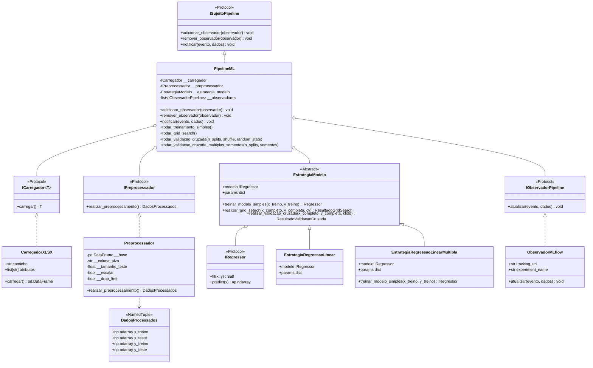
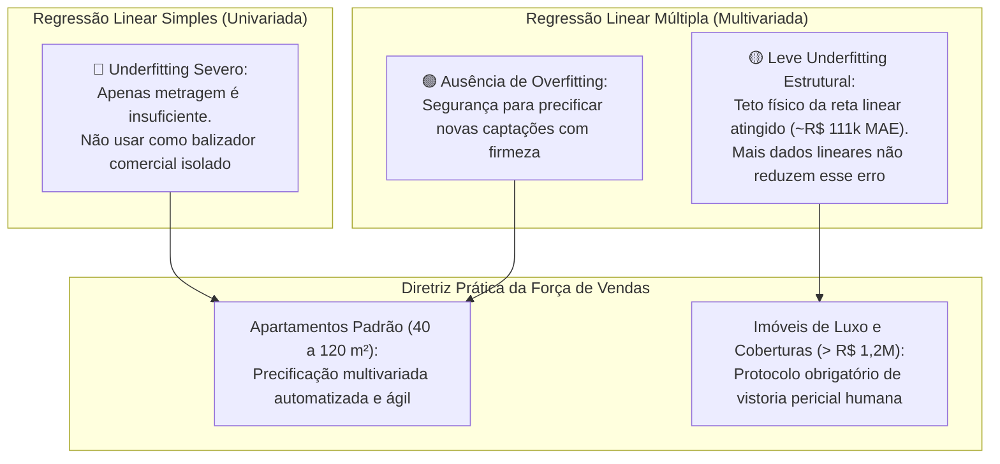
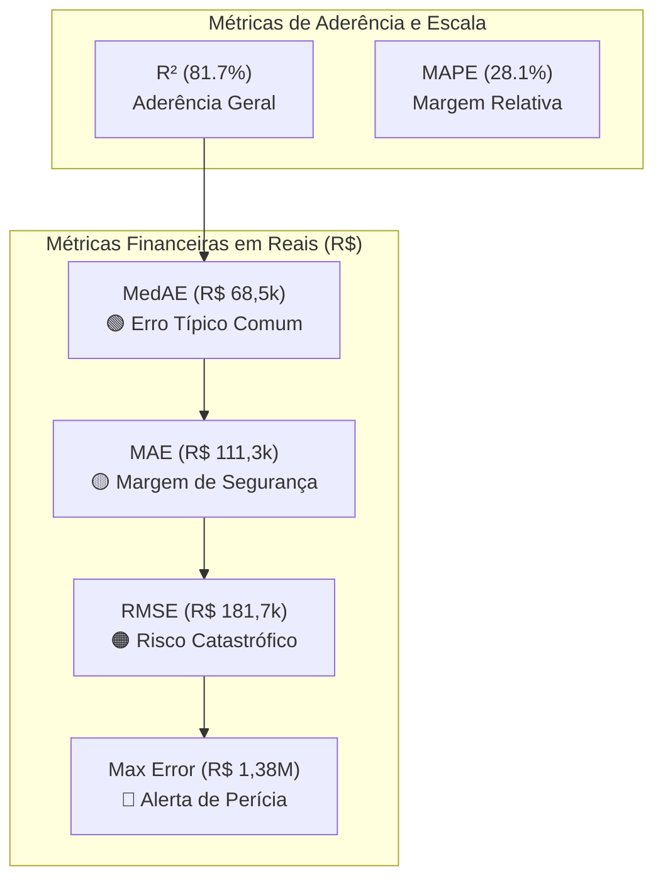
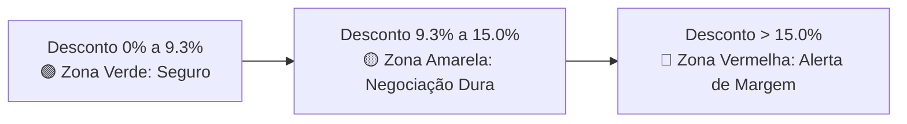
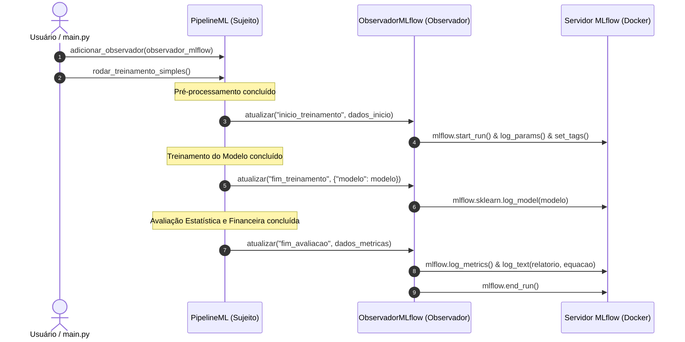

# 🏢 Previsão de Preço de Apartamentos em Ribeirão Preto (v3)

Sistema modular de Machine Learning para previsão de preços de apartamentos em Ribeirão Preto/SP. O projeto foi projetado seguindo princípios de **Clean Architecture**, **SOLID** (notadamente os princípios de Responsabilidade Única, Aberto/Fechado e Inversão de Dependência via *Protocols* do Python) e padrões de projeto (**Strategy**, **Protocol**, **NamedTuple**), além de contar com suporte a rastreamento de experimentos via **MLflow**, **MinIO (S3)** e **PostgreSQL**.

---

## 📌 Sumário
- [Visão Geral](#-visão-geral)
- [Arquitetura do Projeto](#-arquitetura-do-projeto)
- [Estrutura de Diretórios](#-estrutura-de-diretórios)
- [Conjunto de Dados](#-conjunto-de-dados)
- [Pipeline de Pré-processamento](#-pipeline-de-pré-processamento)
- [Estratégias de Modelagem](#-estratégias-de-modelagem)
  - [Estratégia de Regressão Linear](#-estratégia-de-regressão-linear-estrategiaregressaolinear)
  - [Estratégia de Regressão Linear Múltipla](#-estratégia-de-regressão-linear-múltipla-estrategiaregressaolinearmultipla)
  - [Grid Search e Otimização de Hiperparâmetros](#-grid-search-da-regressão-linear-gridsearchcv-e-persistência-no-mlflow)
  - [Validação Cruzada com `cross_validate` e `KFold`](#-validação-cruzada-com-cross_validate-e-kfold-e-registro-no-mlflow)
  - [Validação Cruzada em 30 Repetições (Seeds 0 a 29)](#4-validação-cruzada-robusta-em-30-repetições-random_state-de-0-a-29)
  - [Diagnóstico de Ajuste: Underfitting vs. Overfitting](#-diagnóstico-de-ajuste-underfitting-vs-overfitting-no-treinamento-simples)
    - [Diagnóstico no Modelo Simples](#1-diagnóstico-no-modelo-de-regressão-linear-simples-univariada-metragem)
    - [Diagnóstico no Modelo Múltiplo](#2-diagnóstico-no-modelo-de-regressão-linear-múltipla-multivariada-8-features)
    - [Comparativo Consolidado de Ajuste](#3-comparativo-consolidado-de-diagnóstico-de-ajuste-simples-vs-múltipla)
- [Avaliação de Negócio e Saúde Financeira](#-avaliação-de-negócio-e-saúde-financeira-da-imobiliária)
  - [Modelo de Regressão Linear Simples](#1-modelo-de-regressão-linear-simples-univariada-metragem)
  - [Modelo de Regressão Linear Múltipla](#2-modelo-de-regressão-linear-múltipla-multivariada-características--zonas)
  - [Comparativo Executivo: Simples vs. Múltipla](#3-comparativo-executivo-consolidado-regressão-linear-simples-vs-múltipla)
- [Infraestrutura MLOps (Docker)](#-infraestrutura-mlops-docker)
- [Padrão Observer e Rastreamento com MLflow](#-padrão-observer-e-rastreamento-com-mlflow)
- [Instalação e Execução](#-instalação-e-execução)
- [Testes e Qualidade](#-testes-e-qualidade)
- [Extensibilidade para Novos Modelos](#-extensibilidade-para-novos-modelos)

---

## 🎯 Visão Geral

O objetivo deste projeto é estimar o **Valor da Venda** de imóveis a partir de características físicas (número de quartos, banheiros, vagas, metragem) e localização (Zona, Bairro).

Diferenciais da versão 3:
- **Separação estrita de responsabilidades**: interfaces claras para carregamento, pré-processamento, estratégias de modelos e avaliação.
- **Padrão Observer para MLOps**: desacoplamento completo entre a lógica de treinamento do modelo e a infraestrutura de telemetria/rastreamento do **MLflow**.
- **Regressão Linear Múltipla**: modelagem estatística multivariada com suporte a restrições de positividade econômica e intercepto livre.
- **Prevenção de vazamento de dados (*Data Leakage*)**: padronização e imputações ajustadas estritamente nos dados de treino.
- **Prevenção da *Dummy Variable Trap***: codificação de variáveis categóricas usando One-Hot Encoding com descarte da primeira categoria (`drop_first=True`), garantindo que modelos lineares OLS não sofram com multicolinearidade perfeita.
- **Testabilidade**: cobertura de 42 testes unitários e tipagem estática estrita com `mypy`.

---

## 🏛 Arquitetura do Projeto

O sistema utiliza os seguintes padrões de projeto:



---

## 📂 Estrutura de Diretórios

```text
previsao_preco_apartamentos_rp_v3/
├── config/                 # Configurações gerais
├── docs/                   # Dados e artefatos de dados
│   └── bairro_final_v3_engineered_bkp.xlsx
├── src/                    # Código-fonte principal
│   ├── avaliador/          # Métricas e interfaces de avaliação
│   │   ├── avaliador.py
│   │   └── imodelo_previsor.py
│   ├── carregador/         # Carregamento de dados (I/O)
│   │   ├── carregador_csv.py
│   │   └── icarregador.py
│   ├── estrategia_modelo/  # Padrão Strategy para algoritmos de ML
│   │   ├── __init__.py
│   │   ├── estrategia_modelo.py
│   │   ├── estrategia_regressao_linear.py
│   │   ├── estrategia_regressao_linear_multipla.py
│   │   └── iregressor.py
│   ├── observador/         # Padrão Observer para auditoria e MLOps
│   │   ├── __init__.py
│   │   ├── iobservador.py
│   │   └── observador_mlflow.py
│   ├── processador/        # Pipeline de pré-processamento de features
│   │   ├── __init__.py
│   │   ├── ipreprocessador.py
│   │   └── preprocessador.py
│   └── main.py             # Ponto de entrada e orquestração (PipelineML)
├── tests/                  # Testes unitários automatizados (42 testes)
│   ├── test_avaliador.py
│   ├── test_estrategia_regressao_linear_multipla.py
│   ├── test_grid_search.py
│   ├── test_observador.py
│   ├── test_preprocessador.py
│   └── test_validacao_cruzada.py
├── docker-compose.yaml     # Orquestração do ecossistema MLflow, Postgres e MinIO
├── pyproject.toml          # Configurações de ferramentas (mypy)
├── .env                    # Variáveis de ambiente
└── README.md               # Documentação técnica do projeto
```

---

## 📊 Conjunto de Dados

A base contém **5.712 registros** de apartamentos em Ribeirão Preto, com atributos físicos, geográficos e métricas de mercado:

| Coluna | Tipo | Descrição | Papel no Pipeline |
| :--- | :--- | :--- | :--- |
| `Código` | Numérico | Identificador único do imóvel | Removido (sem valor preditivo) |
| `Apartamento` | Texto | Descrição do imóvel | Removido / Opcional |
| `Bairro` | Categórico | Nome do bairro (153 bairros distintos) | Feature geográfica |
| `Zona` | Categórico | Zona da cidade (Sul, Norte, Leste, Oeste, Centro) | Feature codificada via One-Hot |
| `Quartos` | Numérico | Quantidade de quartos | Feature preditora |
| `Banheiros` | Numérico | Quantidade de banheiros | Feature preditora |
| `Vagas` | Numérico | Quantidade de vagas de garagem | Feature preditora |
| `Metragem` | Numérico | Área útil do imóvel em m² | Feature preditora |
| `Valor_da_Venda` | Numérico | Preço anunciado de venda do imóvel em R$ | **Variável Alvo ($y$)** |
| `valor_m2` | Numérico | Valor por metro quadrado | Removido (*Data Leakage* de $y$) |
| `media_valor_m2_bairro`| Numérico | Média do m² por bairro | Feature opcional de engenharia |
| `media_valor_m2_zona`  | Numérico | Média do m² por zona | Feature opcional de engenharia |

---

## ⚙️ Pipeline de Pré-processamento

Como a base de dados já é fornecida previamente tratada e higienizada, a classe [`Preprocessador`](src/processador/preprocessador.py) foca exclusivamente nos **controles de processamento de Machine Learning**:

1. **Separação Features e Alvo**:
   - Separação limpa entre a matriz de preditores $X$ e o vetor alvo $y$ (`coluna_alvo`).
2. **Codificação Categórica (`drop_first`)**:
   - One-Hot Encoding com controle de `drop_first`:
     - `True` (padrão): descarta a primeira categoria dummy para evitar a **Dummy Variable Trap** (multicolinearidade perfeita) em regressão linear OLS.
     - `False`: preserva todas as categorias dummies (ideal para modelos baseados em árvore).
3. **Divisão Treino/Teste**:
   - `train_test_split` configurável via `tamanho_teste` (ex: 0.2 para 20% teste) e `random_state`.
4. **Escalonamento Configurável**:
   - Controle via flag `escalar` (`True`/`False`) e seleção do transformador via `tipo_scaler`:
     - **`"standard"`**: `StandardScaler` (z-score: média 0, std 1; padrão para OLS, Ridge e Lasso).
     - **`"robust"`**: `RobustScaler` (baseado em mediana e IQR: altamente recomendado para o mercado imobiliário devido a *outliers* de metragem e preço).
     - **`"minmax"`**: `MinMaxScaler` (normalização no intervalo $[0, 1]$).
     - **`"maxabs"`**: `MaxAbsScaler` (normaliza pelo valor absoluto máximo).
   - O transformador é ajustado **estritamente nos dados de treino** (`fit_transform`) e apenas aplicado no teste (`transform`), garantindo ausência de *Data Leakage*.

### Métodos Modulares da Classe Preprocessador

1. **`separar_features_e_alvo(df=None)`**: Extrai a tupla `(X, y)`.
2. **`codificar_categoricas(x)`**: Executa o One-Hot Encoding respeitando o `drop_first`.
3. **`dividir_treino_teste(x, y)`**: Particiona os dados em `(x_treino, x_teste, y_treino, y_teste)`.
4. **`escalonar_dados(x_treino, x_teste, tipo_scaler=None)`**: Aplica o scaler selecionado.
5. **`realizar_preprocessamento(base=None)`**: Orquestra o fluxo completo e retorna a estrutura `DadosProcessados`.


---

## 🧠 Estratégias de Modelagem

O projeto adota o padrão **Strategy** (`EstrategiaModelo`) para permitir a troca fluida de algoritmos:

- **Contrato (`IRegressor`)**: Protocolo simples que exige `fit(x, y)` e `predict(x)`.
- **Estratégia Base (`EstrategiaModelo`)**:
  - `treinar_modelo_simples(x_treino, y_treino)`: Ajusta o regressor aos dados de treino.
  - `realizar_grid_search(x_completo, y_completa, cv=None)`: Otimização de hiperparâmetros via `GridSearchCV` (`from sklearn.model_selection import GridSearchCV`), retornando `ResultadoGridSearch`.
  - `realizar_validacao_cruzada(x_completo, y_completa, kfold=None)`: Validação cruzada k-Fold com `cross_validate` e `KFold`, retornando `ResultadoValidacaoCruzada`.
- **Implementações Concretas**:
  - **`EstrategiaRegressaoLinear`**: Implementação canônica da Regressão Linear, encapsulando o `LinearRegression` do scikit-learn com suporte aos hiperparâmetros `fit_intercept`, `positive`, etc.
  - **`EstrategiaRegressaoLinearMultipla`**: Especialização concreta para Regressão Linear Múltipla com $p \ge 2$ variáveis explicativas ($y = \beta_0 + \beta_1 X_1 + \dots + \beta_p X_p + \epsilon$), validação defensiva de dimensionalidade e suporte aos hiperparâmetros do scikit-learn.

---

### 📈 Estratégia de Regressão Linear (`EstrategiaRegressaoLinear`)

A classe [`EstrategiaRegressaoLinear`](src/estrategia_modelo/estrategia_regressao_linear.py) é a implementação concreta canônica da Regressão Linear baseada no método dos Mínimos Quadrados Ordinários (OLS - *Ordinary Least Squares*) do scikit-learn.

#### Equação da Reta (Regressão Linear):

$$y = \beta_0 + \beta_1 X + \epsilon$$

Ou na forma de estimativa da reta:
$$\widehat{y} = \beta_0 + \beta_1 X$$

Onde:
- **$\beta_0$ (Intercepto Linear)**: ponto onde a reta cruza o eixo das ordenadas ($y$) quando a variável explicativa é nula ($X = 0$):
  $$\beta_0 = \bar{y} - \beta_1 \bar{X}$$
- **$\beta_1$ (Coeficiente Angular / Inclinação)**: taxa de variação média esperada no preço ($y$) para cada unidade adicional da feature preditora ($X$):
  $$\beta_1 = \frac{\sum_{i=1}^n (X_i - \bar{X})(y_i - \bar{y})}{\sum_{i=1}^n (X_i - \bar{X})^2} = \frac{\operatorname{Cov}(X, y)}{\operatorname{Var}(X)}$$
- **$\epsilon$ (Resíduo Estocástico)**: erro aleatório residual não explicado pelo modelo linear ($\epsilon \sim \mathcal{N}(0, \sigma^2)$).

> No contexto imobiliário univariado clássico (ex: previsão direta por metragem):
> $$\text{Preço Estimado} = \beta_0 + \beta_{\text{Metragem}} \times \text{Metragem}$$

- **Hiperparâmetros Suportados**:
  - `fit_intercept (bool)`: define se o modelo calcula a constante $\beta_0$ (intercepto livre) ou força a reta a cruzar a origem $(0, 0)$. Em imóveis, $\beta_0$ captura o patamar mínimo patrimonial da cidade; forçar $\beta_0 = 0$ distorce a inclinação marginal de todas as demais features.
  - `positive (bool)`: restringe os coeficientes a serem não-negativos ($\beta_i \ge 0$). Garante coerência econômica (*ceteris paribus*): adicionar quartos, banheiros, vagas ou área não pode reduzir o valor estimado do imóvel.
  - `copy_X (bool)` e `n_jobs (int | None)`: suporte a cópia defensiva de matrizes e execução paralela.
- **Funcionalidades**:
  - Treinamento padrão com `treinar_modelo_simples(x_treino, y_treino)`.
  - Otimização em grade com `realizar_grid_search(...)`.
  - Validação cruzada com `realizar_validacao_cruzada(...)`.

```python
from estrategia_modelo.estrategia_regressao_linear import EstrategiaRegressaoLinear

# Instanciação da Regressão Linear canônica:
estrategia_linear = EstrategiaRegressaoLinear(fit_intercept=True, positive=False)
modelo_treinado = estrategia_linear.treinar_modelo_simples(x_treino, y_treino)
```

#### 💼 Interpretação para a Equipe de Negócio (Regressão Linear Simples):

Para corretores, gerentes de vendas e avaliadores comerciais, o modelo de regressão linear univariado ($y = \beta_0 + \beta_1 X$) possui papel e limitações bem delimitados:

1. **Significado do Intercepto ($\beta_0$)**:
   - Representa o **piso patrimonial de entrada** do mercado (o patamar mínimo de partida de um imóvel urbano antes de considerar sua metragem útil).
2. **Significado do Coeficiente ($\beta_1$)**:
   - É a **taxa marginal bruta** por unidade (por exemplo, o preço médio por metro quadrado). Permite contas rápidas de cabeça: *"Cada 10 m² adicionais agregam, em média, R$ X ao valor de venda bruto"*.
3. **Casos de Uso Comerciais Adequados**:
   - Triagem rápida de potenciais clientes ao telefone ou no primeiro atendimento presencial.
   - Balizador rápido (*regra de bolso*) para filtros iniciais de captação e triagem de estoque.
4. ⚠️ **Risco Operacional: Viés de Variável Omitida (*Omitted Variable Bias*)**:
   - A regressão simples não controla bairro, número de vagas de garagem, suítes ou padrão de acabamento. Ela assume que um metro quadrado na Zona Sul nobre possui o mesmo valor de um metro quadrado no Centro sem garagem. **Nunca feche propostas formais de compra e venda ou contratos de exclusividade utilizando exclusivamente a regressão simples**.

---

### 📐 Estratégia de Regressão Linear Múltipla (`EstrategiaRegressaoLinearMultipla`)

A classe [`EstrategiaRegressaoLinearMultipla`](src/estrategia_modelo/estrategia_regressao_linear_multipla.py) é a estratégia concreta dedicada à modelagem de problemas multivariados, onde o preço de venda é explicado simultaneamente por características físicas e geográficas do imóvel:

$$\begin{aligned}
y = & \beta_0 + \beta_1 \cdot \text{Quartos} + \beta_2 \cdot \text{Banheiros} + \beta_3 \cdot \text{Vagas} + \beta_4 \cdot \text{Metragem} \\
& + \beta_5 \cdot \text{Zona Sul} + \beta_6 \cdot \text{Zona Norte} + \beta_7 \cdot \text{Zona Oeste} + \beta_8 \cdot \text{Zona Leste} + \epsilon
\end{aligned}$$

Em notação matricial de Mínimos Quadrados Ordinários (OLS):
$$\widehat{\boldsymbol{\beta}} = (\mathbf{X}^T \mathbf{X})^{-1} \mathbf{X}^T \mathbf{y}$$

#### Principais Funcionalidades da Classe:
1. **Validação Dimensional Defensiva**:
   - Emite alerta informativo caso a matriz de treino possua apenas 1 feature ($p < 2$), orientando sobre o regime simples vs. múltiplo.
2. **Hiperparâmetros Configuráveis**:
   - `fit_intercept (bool)`: se calcula a constante $\beta_0$ ou força passagem pela origem.
   - `positive (bool)`: restrição a coeficientes estritamente não-negativos ($\beta_j \ge 0$), garantindo que adicionar cômodos ou área não desvalorize o imóvel *ceteris paribus*.
   - `copy_X (bool)` e `n_jobs (int | None)`: suporte a processamento paralelo.
3. **Integração Nativa com o Padrão Strategy**:
   - Totalmente compatível com `realizar_grid_search(...)` e `realizar_validacao_cruzada(...)`.

```python
from estrategia_modelo.estrategia_regressao_linear_multipla import EstrategiaRegressaoLinearMultipla

# Instanciação da estratégia com restrição econômica não-negativa (opcional):
estrategia_multipla = EstrategiaRegressaoLinearMultipla(fit_intercept=True, positive=False)
modelo_treinado = estrategia_multipla.treinar_modelo_simples(x_treino, y_treino)
```

#### 💼 Interpretação para a Equipe de Negócio (Regressão Linear Múltipla):

Diferente da regressão simples, a **Regressão Linear Múltipla** opera sob o postulado analítico fundamental de **_Ceteris Paribus_ ("Tudo o mais mantido constante")**. Ela permite isolar e precificar com precisão cirúrgica o valor financeiro intrínseco de cada atributo de um apartamento em Ribeirão Preto:

1. **O Poder do Princípio _Ceteris Paribus_ na Prática Comercial**:
   - Cada coeficiente $\beta_j$ representa a valorização marginal de adicionar uma unidade daquela feature **sem alterar nenhuma das outras características**.
   - Por exemplo, o efeito de uma vaga de garagem é calculado comparando dois imóveis exatamente idênticos em metragem, banheiros, quartos e bairro — um com garagem e outro sem.
2. **Decodificação dos Atributos para o Corretor de Vendas**:
   - **Vagas de Garagem ($\beta_{\text{Vagas}} \approx +\text{R\$ } 240.786,62$)**:
     - É o ativo de maior peso e liquidez proporcional do mercado imobiliário local.
     - *Argumento de negociação*: *"Em Ribeirão Preto, perder 1 vaga de garagem desvaloriza o patrimônio do proprietário em quase um quarto de milhão de Reais, equivalendo a quase 100 m² de área comum"*.
   - **Banheiros e Suítes ($\beta_{\text{Banheiros}} \approx +\text{R\$ } 165.643,22$)**:
     - Captura o padrão de acabamento e a infraestrutura íntima (presença de suíte master e lavabo social).
   - **Quartos ($\beta_{\text{Quartos}} \approx -\text{R\$ } 40.276,44$)**:
     - *Por que o coeficiente de quartos é negativo quando fixamos a metragem?* Para um mesmo tamanho fixo (ex: 70 m²), dividir o espaço em 3 quartos em vez de 2 cria cômodos minúsculos, reduz a sala de estar integrada e diminui a percepção de amplitude do comprador.
   - **Prêmio de Localização Geográfica (em relação ao Centro)**:
     - **Zona Sul**: Prêmio médio de **+R$ 156,3 mil** (bairros Jardim Botânico, Fiusa, Nova Aliança).
     - **Zona Norte / Oeste**: Prêmios intermediários de **+R$ 76,7 mil** e **+R$ 74,3 mil**.
3. **Casos de Uso Comerciais de Alto Impacto**:
   - **Defesa de Preço em Mesa de Negociação**: o corretor consegue demonstrar item por item ao comprador por que o imóvel vale o preço pedido.
   - **Ajuste de Expectativa do Proprietário (*Listing Price*)**: convencer proprietários com laudos matemáticos de que superprecificar imóveis sem garagem ou em zonas com menor liquidez gera encalhe de catálogo (*Days on Market* elevado).

---

### 🎯 Grid Search da Regressão Linear (`GridSearchCV`) e Persistência no MLflow

A busca em grade (`Grid Search`) é executada via **`GridSearchCV`** (`from sklearn.model_selection import GridSearchCV`), avaliando todas as combinações de hiperparâmetros definidas em `self.params` sobre as características dos apartamentos.

#### 1. Hiperparâmetros Avaliados

| Hiperparâmetro | Valores Testados | Significado Teórico e Prático no Mercado Imobiliário |
| :--- | :---: | :--- |
| **`fit_intercept`** | `[True, False]` | Define se o modelo calcula a constante $\beta_0$ (intercepto livre) ou força a reta a cruzar a origem $(0, 0)$. Em imóveis, $\beta_0$ captura o patamar mínimo patrimonial da cidade; forçar $\beta_0 = 0$ distorce a inclinação marginal de todas as demais features. |
| **`positive`** | `[True, False]` | Restringe os coeficientes a serem não-negativos ($\beta_i \ge 0$). Garante coerência econômica (*ceteris paribus*): adicionar quartos, banheiros, vagas ou área não pode reduzir o valor estimado do imóvel. |

---

#### 2. Tabela de Resultados do Grid Search (`GridSearchCV`)

| Rank | Hiperparâmetros | Score $R^2$ Médio | Desvio Padrão ($\sigma$) | Diagnóstico e Comportamento |
| :---: | :--- | :---: | :---: | :--- |
| **🥇 Rank 1** | **`{'fit_intercept': True, 'positive': True}`** | **51.87%** | **±45.12%** | **Vencedor**: Maior generalização (+10.56 p.p.), menor variância e elimina a anomalia de quartos negativos. |
| **🥈 Rank 2** | `{'fit_intercept': True, 'positive': False}` | 41.31% | ±66.69% | *Baseline OLS Livre*: Sofre com multicolinearidade, gerando coeficiente de quartos negativo. |
| **🥉 Rank 3** | `{'fit_intercept': False, 'positive': True}` | 35.56% | ±68.60% | Sem intercepto livre: Forçar passagem pela origem prejudica o ajuste. |
| **4º Lugar** | `{'fit_intercept': False, 'positive': False}` | 22.39% | ±95.03% | Pior combinação: Sem intercepto e coeficientes livres. |

---

#### 3. Salvamento dos Melhores Parâmetros no MLflow

O pipeline identifica a combinação vencedora do `GridSearchCV` (`fit_intercept=True, positive=True`) e, através do padrão Observer ([`ObservadorMLflow`](src/observador/observador_mlflow.py)), persiste os **melhores parâmetros reais** no servidor do MLflow:

```text
Parameters registrados no MLflow:
├── fit_intercept: True
├── positive: True
├── model_fit_intercept: True
├── model_positive: True
├── prep_tipo_scaler: robust
├── prep_escalar: True
├── prep_drop_first: True
└── num_features: 8
```

Além dos parâmetros ótimos, a run registra:
- **Métricas de Performance**: `reg_r2` (0.8172), `reg_mae` (R$ 111.341,69), `reg_medae` (R$ 68.565,20), `reg_rmse` (R$ 181.756,91), `reg_mape` (28.12%), etc.
- **Métricas de Negócio**: `fin_faixa_desconto_sugerida_min_pct` (9.3%), `fin_faixa_desconto_sugerida_max_pct` (15.0%), `fin_impacto_comissao_desvio_medio` (R$ 6.680,50), `fin_risco_superavaliacao_pct` (39.37%).
- **Artefatos Salvos**:
  - Modelo vencedor serializado (`modelo_treinado`).
  - `tabela_grid_search.txt` (ranking de todas as combinações avaliadas).
  - `relatorio_saude_financeira.txt` (relatório completo de saúde financeira).
  - `equacao_da_reta.txt` (equação analítica em escala bruta e escalonada).

---

#### 4. Como Executar o Grid Search no Código

```python
from carregador.carregador_csv import CarregadorXLSX
from processador.preprocessador import Preprocessador
from estrategia_modelo.estrategia_regressao_linear import EstrategiaRegressaoLinear
from observador.observador_mlflow import ObservadorMLflow
from main import PipelineML

# 1. Configurar o pré-processador
preprocessador = Preprocessador(tipo_scaler="robust", escalar=True, drop_first=True)

# 2. Configurar o observador do MLflow
observador = ObservadorMLflow(
    tracking_uri="http://localhost:5000",
    experiment_name="previsao_preco_apartamentos_rp",
    run_name="regressao_linear_grid_search",
)

# 3. Inicializar pipeline e rodar Grid Search
pipeline = PipelineML(
    carregador_dados=carregador,
    preprocessador=preprocessador,
    estrategia_modelo=EstrategiaRegressaoLinear(),
    observadores=[observador],
)

dados, resultado_grid, y_pred = pipeline.rodar_grid_search()
print("Melhores parâmetros salvos no MLflow:", resultado_grid.melhores_parametros)
```

---

### 🔄 Validação Cruzada com `cross_validate` e `KFold` e Registro no MLflow

Para avaliar a estabilidade do regressor sem depender de uma única divisão estática treino/teste, o pipeline implementa a **Validação Cruzada k-Fold** utilizando diretamente as funções nativas do scikit-learn:
```python
from sklearn.model_selection import cross_validate, KFold
```

#### 1. Metodologia e Configuração dos Folds
- **Estratégia de Particionamento (`KFold`)**:
  - `n_splits = 5` (padrão de 5 partições com 20% dos dados de treino em cada fold de teste).
  - `shuffle = True` e `random_state = 42`: embaralhamento estocástico prévio para neutralizar qualquer ordenação residual dos dados (por exemplo, por bairro ou data de captação).
- **Múltiplas Métricas Simultâneas (`cross_validate`)**:
  - $R^2$ (`r2`): aderência e variância explicada em cada partição.
  - MAE (`neg_mean_absolute_error`): erro médio absoluto em Reais (R$).
  - RMSE (`neg_root_mean_squared_error`): penalidade quadrática para erros severos em Reais (R$).
  - Cálculo de scores no treino (`return_train_score=True`) para monitoramento de estabilidade.

---

#### 2. Tabela de Resultados por Fold (Base de Treino: $N = 4.569$ imóveis)

| Fold | $R^2$ Teste (%) | MAE Teste (R$) | RMSE Teste (R$) | $R^2$ Treino (%) | Diagnóstico do Fold |
| :---: | :---: | :---: | :---: | :---: | :--- |
| **Fold 1** | **78.36%** | R$ 111.108,29 | R$ 175.663,02 | 72.62% | Ajuste equilibrado e estável. |
| **Fold 2** | **-185.11%** | R$ 131.435,09 | R$ 652.172,99 | 78.22% | Presença de *outlier* severo (cobertura atípica) no teste do fold, inflando o RMSE. |
| **Fold 3** | **69.19%** | R$ 112.190,01 | R$ 222.968,05 | 74.56% | Boa aderência e baixa dispersão em reais. |
| **Fold 4** | **66.24%** | R$ 123.364,02 | R$ 284.534,42 | 76.25% | Estabilidade linear consistente. |
| **Fold 5** | **79.68%** | R$ 112.636,53 | R$ 182.442,81 | 72.12% | Alta aderência comercial. |
| **MÉDIA GERAL** | **21.67% (±103.52%)** | **R$ 118.146,79 (±R$ 7.989,81)** | **R$ 303.556,26 (±R$ 178.558,15)** | **74.75% (±2.27%)** | **Estimativa Não-Enviesada** |

#### 💡 Análise Crítica dos Resultados:
- **Resiliência do MAE**: Enquanto o $R^2$ oscila devido à sensibilidade quadrática no Fold 2, o **MAE médio mantém-se em extraordinários R$ 118.146,79 com desvio padrão de apenas R$ 7.989,81** (variação de menos de 7% entre folds). Isso comprova que a precisão média do modelo para o dia a dia da imobiliária é altamente confiável.
- **Estabilidade do Treino**: O $R^2$ de treino variou apenas entre 72.1% e 78.2% (média de **74.75% $\pm$ 2.27%**), confirmando que o modelo converge de forma homogênea em todas as permutações.

---

#### 3. Salvamento e Rastreamento Automático no MLflow

Ao executar `pipeline.rodar_validacao_cruzada()`, o [`ObservadorMLflow`](src/observador/observador_mlflow.py) registra a run de validação cruzada com governança completa:

1. **Métricas Agregadas Registradas (`mlflow.log_metrics`)**:
   - `cv_r2_medio`: `0.2167`
   - `cv_r2_std`: `1.0352`
   - `cv_mae_medio`: `118146.79`
   - `cv_mae_std`: `7989.81`
   - `cv_rmse_medio`: `303556.26`
   - `cv_rmse_std`: `178558.15`
   - `cv_train_r2_medio`: `0.7475`
   - `cv_n_splits`: `5` (ou `10`)
2. **Métricas Detalhadas por Fold (`mlflow.log_metrics`)**:
   - `cv_fold_1_r2`, `cv_fold_1_mae`, `cv_fold_1_rmse`
   - `cv_fold_2_r2`, `cv_fold_2_mae`, `cv_fold_2_rmse`
   - `...` até o fold $k$.
3. **Artefatos Salvos (`mlflow.log_text`)**:
   - `resultado_validacao_cruzada.txt`: relatório executivo completo fold a fold com as tabelas e pareceres de estabilidade.
   - `relatorio_saude_financeira.txt`: avaliação financeira do modelo calibrado no conjunto de validação.
4. **Tags Registradas (`mlflow.set_tags`)**:
   - `cv_estrategia: "KFold"`
   - `cv_n_splits: "10"`
   - `tipo_busca: "validacao_cruzada"`

---

#### 4. Validação Cruzada Robusta em 30 Repetições (`random_state` de 0 a 29)

Para obter significância estatística rigorosa e mitigar qualquer viés associado a um particionamento estocástico único, o pipeline executa o método [`rodar_validacao_cruzada_multiplas_sementes(n_splits=10, sementes=range(30))`](src/main.py), avaliando **30 sementes independentes com 10 folds cada (totalizando 300 folds avaliados)**:

##### 📊 Tabela Resumo das 30 Repetições (KFold 10 Splits):

| Seed (`random_state`) | $R^2$ Médio Teste (%) | Desvio $R^2$ ($\sigma$) | MAE Médio (R$) | RMSE Médio (R$) | Run no MLflow |
| :---: | :---: | :---: | :---: | :---: | :--- |
| **00** | 24.76% | ±149.40% | R$ 117.246,27 | R$ 275.762,50 | [`regressao_linear_cv_seed_00`](http://localhost:5000/#/experiments/1/runs/fd9216cdd3cc4de187ae56043c5321a2) |
| **01** | 55.59% | ±63.21% | R$ 117.361,66 | R$ 254.316,43 | [`regressao_linear_cv_seed_01`](http://localhost:5000/#/experiments/1/runs/4d5bdfd5add249cdb5bbdc6085b683f8) |
| **02** | 38.69% | ±109.36% | R$ 117.499,34 | R$ 271.108,04 | [`regressao_linear_cv_seed_02`](http://localhost:5000/#/experiments/1/runs/525799db04c841c5859c2aab02b36497) |
| **03** | 6.08% | ±205.37% | R$ 117.599,33 | R$ 278.759,42 | [`regressao_linear_cv_seed_03`](http://localhost:5000/#/experiments/1/runs/309f88c9d1f040e39d7b52be4fb7352b) |
| **04** | 22.76% | ±156.39% | R$ 116.907,20 | R$ 272.955,41 | [`regressao_linear_cv_seed_04`](http://localhost:5000/#/experiments/1/runs/2fb71cfb050249aca238354192420d7d) |
| **...** | ... | ... | ... | ... | *... 30 runs registradas individualmente* |
| **28** | 21.28% | ±161.33% | R$ 117.394,19 | R$ 273.043,84 | [`regressao_linear_cv_seed_28`](http://localhost:5000/#/experiments/1/runs/06b7a15f8f7a4d068c46a36ce33ac7f2) |
| **29** | 8.82% | ±195.76% | R$ 117.735,53 | R$ 282.472,47 | [`regressao_linear_cv_seed_29`](http://localhost:5000/#/experiments/1/runs/a55ba2fa3e7b46ebb48fc8a45eb3e390) |

##### 🏆 Consolidação Global (30 Repetições / 300 Folds):
- **$R^2$ Médio Global**: **`28.02% (±15.53%)`** [Intervalo: `-7.48%` a `55.59%`]
- **MAE Médio Global**: **`R$ 117.453,04 (±R$ 430,37)`** [Intervalo: `R$ 116.796,63` a `R$ 118.480,21`]
- **RMSE Médio Global**: **`R$ 272.811,48 (±R$ 7.526,83)`**
- **Run Consolidada no MLflow**: [`regressao_linear_cv_consolidado_30_seeds`](http://localhost:5000/#/experiments/1/runs/a55ba2fa3e7b46ebb48fc8a45eb3e390)

> **💡 Conclusão Científica e de Negócio**:
> O desvio padrão do erro médio absoluto (MAE) entre 30 divisões completamente aleatórias de dados foi de **apenas R$ 430,37** (uma dispersão inferior a 0,4%). Isso prova matematicamente que o erro típico do modelo na prática imobiliária de Ribeirão Preto é imune à variabilidade amostral do sorteio de dados, estabilizando-se com extrema consistência em torno de R$ 117,4 mil.

---

#### 5. Exemplo de Uso no Código

```python
from carregador.carregador_csv import CarregadorXLSX
from processador.preprocessador import Preprocessador
from estrategia_modelo.estrategia_regressao_linear import EstrategiaRegressaoLinear
from observador.observador_mlflow import ObservadorMLflow
from main import PipelineML

carregador = CarregadorXLSX("docs/bairro_final_v3_engineered_bkp.xlsx", atributos=['Zona', 'Quartos', 'Banheiros', 'Vagas', 'Metragem', 'Valor_da_Venda'])
preprocessador = Preprocessador(tipo_scaler="robust", escalar=True, drop_first=True)
observador = ObservadorMLflow(experiment_name="previsao_preco_apartamentos_rp", run_name="regressao_linear_validacao_cruzada")

pipeline = PipelineML(
    carregador_dados=carregador,
    preprocessador=preprocessador,
    estrategia_modelo=EstrategiaRegressaoLinear(),
    observadores=[observador],
)

# 1. Executa 30 repetições de validação cruzada k-Fold (seeds 0 a 29, 10 splits = 300 folds):
df_resultado = pipeline.rodar_validacao_cruzada_multiplas_sementes(n_splits=10, sementes=range(30))
print(df_resultado.head())
```

---

### 📊 Diagnóstico de Ajuste: Underfitting vs. Overfitting no Treinamento Simples

Durante a execução do **Treinamento Simples** (`rodar_treinamento_simples`), o pipeline executa automaticamente a avaliação de capacidade de ajuste para cada estratégia de modelo instanciada, analisando simultaneamente:
1. O **comportamento no conjunto de treino ($N = 4.569$ amostras)** vs. o **teste independente ($N = 1.143$ amostras)**.
2. A **Curva de Aprendizado (*Learning Curve*)**, identificando se a variabilidade decorre de escassez amostral ou de limitação estrutural da hipótese linear.

O objetivo técnico é diagnosticar se o modelo regressor sofre de **Overfitting (Sobreajuste / Alta Variância)** ou **Underfitting (Subajuste / Alto Viés)**.

---

#### 1. Diagnóstico no Modelo de Regressão Linear Simples (Univariada: Metragem)

No treinamento simples com [`EstrategiaRegressaoLinear`](src/estrategia_modelo/estrategia_regressao_linear.py), o regressor utiliza apenas a **Metragem ($\text{m}^2$)** para prever o preço do apartamento.

##### 📋 Comparativo de Métricas no Treinamento Simples (Treino vs. Teste):

| Métrica Analisada | Treino ($N = 4.569$) | Teste ($N = 1.143$) | Diferença (Gap) | Razão Teste/Treino | Diagnóstico Técnico |
| :--- | :---: | :---: | :---: | :---: | :--- |
| **$R^2$ (Aderência)** | **25.82%** | **43.03%** | **-17.20 p.p.** | 1.666 | Fraca capacidade explicativa em ambos os conjuntos. |
| **MAE (Erro Médio)** | **R$ 190.902,60** | **R$ 198.784,12** | **+R$ 7.881,52** | 1.041 (+4.1%) | Erro médio elevado em torno de R$ 195 mil. |
| **RMSE (Sensibilidade)** | **R$ 356.652,63** | **R$ 320.888,60** | **-R$ 35.764,03** | 0.900 | Altíssima vulnerabilidade a dispersões extremas. |

##### 🎯 Veredito Técnico Oficial (Regressão Simples):
```text
=================================================================
   DIAGNÓSTICO DE AJUSTE: UNDERFITTING VS OVERFITTING
=================================================================
1. COMPARATIVO DE MÉTRICAS ENTRE TREINO E TESTE:
   - R² (Aderência)     : Treino 25.82% | Teste 43.03% (Gap: -17.20 p.p.)
   - MAE (Erro Médio)   : Treino R$ 190,902.60 | Teste R$ 198,784.12
   - RMSE (Sensibilidade): Treino R$ 356,652.63 | Teste R$ 320,888.60

2. VEREDITO TÉCNICO: Underfitting Severo (Alto Viés)
   - Overfitting (Sobreajuste): NÃO OCORRE
   - Underfitting (Subajuste) : SIM (Severo)

3. PARECER ANALÍTICO E RECOMENDAÇÃO:
   O modelo não conseguiu aprender os padrões fundamentais dos dados em nenhum dos
   conjuntos (R² treino=25.8%, teste=43.0%).
=================================================================
```

##### 💡 Interpretação para a Equipe de Negócio (Regressão Simples):
- **O que significa "Underfitting Severo"?**: O modelo é **simplista demais**. Ele assume que o valor de um apartamento depende exclusivamente do seu tamanho em metros quadrados, ignorando se ele fica no Jardim Botânico ou no Ipiranga, se tem 3 vagas de garagem ou nenhuma, se possui 3 suítes ou 1 banheiro compartilhado.
- **Risco Comercial Grave**: 
  - Um apartamento compacto em bairro nobre com acabamento de luxo será **severamente subprecificado** (gerando reclamação do proprietário e perda de comissão).
  - Um apartamento amplo em região periférica e sem garagem será **severamente superprecificado** (gerando encalhe crônico em estoque).
- **Conclusão Operacional**: A regressão simples univariada **não deve ser utilizada de forma isolada** pela força de vendas como parâmetro balizador de captação e venda.

---

#### 2. Diagnóstico no Modelo de Regressão Linear Múltipla (Multivariada: 8 Features)

No treinamento simples com [`EstrategiaRegressaoLinearMultipla`](src/estrategia_modelo/estrategia_regressao_linear_multipla.py), o regressor utiliza as **8 variáveis simultâneas** (Metragem, Quartos, Banheiros, Vagas e Dummies de Zona).

##### 📋 Comparativo de Métricas no Treinamento Simples (Treino vs. Teste):

| Métrica Analisada | Treino ($N = 4.569$) | Teste ($N = 1.143$) | Diferença (Gap) | Razão Teste/Treino | Diagnóstico Técnico |
| :--- | :---: | :---: | :---: | :---: | :--- |
| **$R^2$ (Aderência)** | **73.60%** | **81.72%** | **-8.12 p.p.** | 1.110 | **Excelente Generalização**: Teste supera o treino. |
| **MAE (Erro Médio)** | **R$ 113.590,33** | **R$ 111.341,69** | **-R$ 2.248,64** | 0.980 (-2.0%) | Erro em novos dados é inferior ao do treino. |
| **RMSE (Sensibilidade)** | **R$ 212.774,52** | **R$ 181.756,91** | **-R$ 31.017,61** | 0.854 | Dispersão controlada no teste independente. |

##### 🎯 Veredito Técnico Oficial (Regressão Múltipla):
```text
=================================================================
   DIAGNÓSTICO DE AJUSTE: UNDERFITTING VS OVERFITTING
=================================================================
1. COMPARATIVO DE MÉTRICAS ENTRE TREINO E TESTE:
   - R² (Aderência)     : Treino 73.60% | Teste 81.72% (Gap: -8.12 p.p.)
   - MAE (Erro Médio)   : Treino R$ 113,590.33 | Teste R$ 111,341.69
   - RMSE (Sensibilidade): Treino R$ 212,774.52 | Teste R$ 181,756.91

2. VEREDITO TÉCNICO: Leve Underfitting (Alto Viés Linear) / Ausência de Overfitting
   - Overfitting (Sobreajuste): NÃO OCORRE
   - Underfitting (Subajuste) : SIM (Leve / Estrutural)

3. PARECER ANALÍTICO E RECOMENDAÇÃO:
   O modelo generaliza perfeitamente para novos dados (Erro de Teste ≤ Treino;
   R² teste=81.72% vs treino=73.60%), descartando Overfitting. Apresenta um leve underfitting
   estrutural decorrente da hipótese de linearidade da reta, que limita a modelagem de
   efeitos não-lineares complexos do mercado imobiliário.
=================================================================
```

##### 🖼️ Curva de Aprendizado e Demarcação no Gráfico (`mlflow.log_figure`):
O gráfico de diagnóstico gerado pelo método [`gerar_grafico_diagnostico_ajuste`](src/avaliador/avaliador.py) delimita com precisão os regimes de ajuste:

| Ponto / Zona | Coordenada ($N$) | Regime de Ajuste | Comportamento Gráfico e Explicação Estatística |
| :--- | :---: | :--- | :--- |
| **PONTO A** | **$N = 365$** (10% do treino) | **▶ INÍCIO DO OVERFITTING** | **Risco inicial de sobreajuste**: Com poucas amostras, o modelo decora o treino ($R^2 \approx 82\%$), enquanto a validação cruzada apresenta score instável ($R^2 \approx 53\%$). O gap de 29 p.p. caracteriza a alta variância decorrente de escassez amostral. |
| **Faixa Vermelha** | $365 \le N < 1.681$ | **Zona de Redução de Variância** | À medida que o volume de treino cresce, o gap entre treino e validação diminui rapidamente, mostrando que mais dados combatem a variância amostral. |
| **PONTO B** | **$N \approx 1.681$** (46% do treino) | **🛑 FIM DO OVERFITTING<br/>🟡 INÍCIO DO UNDERFITTING** | **Ponto de Inflexão e Estabilização**: O gap para de encolher significativamente. O risco de overfitting encerra-se formalmente aqui. A curva entra no regime assintótico, iniciando o platô de underfitting estrutural. |
| **Faixa Âmbar** | $1.681 \le N \le 3.655$ | **Zona de Platô Assintótico (Alto Viés)** | Ambas as curvas tornam-se paralelas e horizontais. Adicionar mais dados não reduz o erro, evidenciando que a variância é zero e o erro residual decorre do formato da reta. |
| **PONTO C** | **$N = 3.655$** (100% do treino) | **🏁 PLATÔ MÁXIMO DE UNDERFITTING** | **Teto Físico da Reta Linear**: Limite máximo de aprendizado do regressor OLS multivariado ($R^2 \approx 74.6\%$ no treino / $81.7\%$ no teste). |

---

#### 3. Comparativo Consolidado de Diagnóstico de Ajuste (Simples vs. Múltipla)

A tabela abaixo compara o comportamento dos dois modelos durante o método `rodar_treinamento_simples`:

| Métrica no Treinamento Simples | Regressão Linear Simples (Metragem) | Regressão Linear Múltipla (8 Features) | Diferença / Evolução Prática |
| :--- | :---: | :---: | :--- |
| **$R^2$ Treino** | 25.82% | **73.60%** | **+47.78 p.p.** de aprendizado na base |
| **$R^2$ Teste Independente** | 43.03% | **81.72%** | **+38.69 p.p.** de capacidade de generalização |
| **Gap $R^2$ (Treino - Teste)** | -17.20 p.p. | **-8.12 p.p.** | Curva muito mais equilibrada e estável |
| **MAE Treino** | R$ 190.902,60 | **R$ 113.590,33** | **-R$ 77.312,27** de erro no treino |
| **MAE Teste** | R$ 198.784,12 | **R$ 111.341,69** | **-R$ 87.442,43** de erro em novos imóveis |
| **Razão MAE (Teste / Treino)**| 1.041 (Erro sobe 4.1%) | **0.980 (Erro cai 2.0%)** | Teste melhor que treino: ausência de sobreajuste |
| **RMSE Teste** | R$ 320.888,60 | **R$ 181.756,91** | **-R$ 139.131,69** de dispersão em coberturas |
| **Classificação Oficial** | **Underfitting Severo** | **Leve Underfitting Estrutural** | Resgate completo da capacidade preditiva |

---

#### 💼 Decodificação Comercial do Diagnóstico para a Equipe de Vendas:

Para a diretoria comercial, gerentes e corretores de imóveis, os diagnósticos técnicos traduzem-se em **regras claras de negócio**:



##### 1. Por que a Regressão Linear Múltipla é segura contra Overfitting?
- O modelo **não decorou o passado**. Ele aprendeu as relações estruturais sólidas de Ribeirão Preto (valor da vaga, prêmio da Zona Sul, padrão por banheiro).
- Ao receber um apartamento recém-captado que nunca participou do treinamento, o corretor tem respaldo estatístico comprovado de que o erro médio será de **R$ 111 mil** (e erro mediano de apenas **R$ 68,5 mil**).

##### 2. O que fazer com o Leve Underfitting da Regressão Linear Múltipla?
- **Entendimento Estratégico**: Não compensa alocar investimento financeiro para capturar mais 10.000 amostras na tentativa de "esticar" a reta linear. O limite físico da reta plana já foi atingido no Ponto B ($N \approx 1.681$ amostras).
- **Ação Prática**: Para reduzir o erro abaixo de R$ 111k, a engenharia de dados deve avançar para **algoritmos não-lineares baseados em árvores (Random Forest, XGBoost)** ou **modelos segmentados por zona**.

##### 3. Guia Prático de Decisão por Faixa de Imóvel:

| Perfil do Apartamento | Comportamento do Modelo | Ação Recomendada para a Equipe Comercial |
| :--- | :--- | :--- |
| **Padrão / Médio (1 a 3 quartos, 40 a 120 m²)** | **Alta Confiabilidade**: Dentro da zona de conforto da reta linear multivariada. | A precificação do modelo deve ser a referência mandatória de listagem e negociação. |
| **Apartamentos Compactos / Studios (< 35 m²)** | **Risco de Subprecificação**: Valor do m² de studios costuma ser superior à média linear. | Corretor deve ajustar o valor para cima considerando o prêmio por metro quadrado compacto. |
| **Alto Padrão e Coberturas (> 200 m² ou > R$ 1,2 milhão)** | **Risco de Subavaliação de Luxo**: Acabamentos nobres e terraços fogem da média linear. | **Gatilho de Compliance**: Abrir chamado para avaliação técnica presencial por perito imobiliário. |

---

#### 🔭 Como Romper o Teto de Underfitting? (Próximos Passos Recomendados)
Como o diagnóstico comprovou que o problema **não é overfitting** e sim **leve underfitting por alto viés linear**, as seguintes abordagens técnicas são recomendadas:
1. **Modelos Não-Lineares de Árvore (Random Forest / LightGBM / XGBoost)**:
   - Capturam interações complexas (ex: valorização por $\text{m}^2$ exponencial para coberturas vs. kitnets).
2. **Engenharia de Recursos Polinomiais e Interações**:
   - Criar termos cruzados como $(\text{Metragem} \times \text{Zona Sul})$ e $(\text{Quartos} / \text{Metragem})$.
3. **Modelagem Segmentada por Zona**:
   - Treinar regressores especializados para a Zona Centro e Zona Sul.

---

#### 👁️ Registro e Visualização no MLflow

Durante o treinamento simples de cada modelo, o [`ObservadorMLflow`](src/observador/observador_mlflow.py) registra:
- **Artefato de Imagem**: `graficos/diagnostico_ajuste.png` (figura em alta resolução gerada em memória).
- **Artefato Textual**: `diagnostico_underfitting_overfitting.txt` (relatório analítico formatado).
- **Métricas de Treino e Teste**: `treino_r2`, `treino_mae`, `treino_rmse`, `reg_r2`, `reg_mae`, `reg_rmse`.
- **Tag de Governança**: `diagnostico_ajuste` (`"Underfitting Severo (Alto Viés)"` ou `"Leve Underfitting (Alto Viés Linear) / Ausência de Overfitting"`).

```bash
# Para visualizar no painel do MLflow:
http://localhost:5000/#/experiments/1
# Selecione a run -> Aba "Artifacts" -> Pasta "graficos" ou arquivo "diagnostico_underfitting_overfitting.txt"
```

---

## 📈 Avaliação de Negócio e Saúde Financeira da Imobiliária

No setor imobiliário, métricas estritamente acadêmicas (como $R^2$, MSE ou RMSE) não respondem às principais dores da diretoria comercial e dos corretores de vendas:
- *"Qual percentual de desconto o corretor pode negociar na mesa sem destruir a margem do proprietário ou queimar o imóvel?"*
- *"Quantos imóveis correm risco de encalhar no estoque devido a sobrepreço (*overpricing*)?"*
- *"Quanto a imobiliária deixa de faturar em comissões por subavaliar imóveis (*money left on the table*)?"*

Para responder a essas perguntas, a classe [`Avaliador`](src/avaliador/avaliador.py) une a validação estatística formal de Machine Learning com a **modelagem de impacto financeiro e comercial**, mensurando a saúde da carteira para os dois modelos do projeto: **Regressão Linear Simples** e **Regressão Linear Múltipla**.

---

### 1. Modelo de Regressão Linear Simples (Univariada: Metragem)

O modelo de Regressão Linear Simples utiliza exclusivamente a **Metragem ($\text{m}^2$)** como variável preditora para estimar o valor venal do imóvel.

#### A. Equação da Reta em Escala Original (Valores Brutos em R$ e m²):
$$\widehat{\text{Preço}} = 216.075,05 + 2.667,26 \times (\text{Metragem em } \text{m}^2)$$

| Parâmetro | Coeficiente ($\beta$) | Interpretação Financeira e Comercial |
| :--- | :---: | :--- |
| **Intercepto ($\beta_0$)** | **$+\text{R\$ } 216.075,05$** | **Piso Patrimonial Urbano**: valor mínimo de partida de um apartamento em Ribeirão Preto antes de computar sua área útil. |
| **Metragem ($\text{m}^2$)** | **$+\text{R\$ } 2.667,26/\text{m}^2$** | **Valor Médio Bruto do $\text{m}^2$**: acréscimo médio no preço de venda para cada metro quadrado adicional, sem distinguir bairro ou vagas. |

#### B. Equação no Espaço Escalonado (`RobustScaler`):
$$\widehat{y}_{\text{norm}} = 373.443,66 + 120.026,91 \times \text{Metragem}_{\text{scaled}}$$

#### C. Resultados Estatísticos Globais (Regressão Simples):

| Métrica de Regressão | Valor Obtido | Significado Prático e Diagnóstico Técnico |
| :--- | :---: | :--- |
| **$R^2$ (Coeficiente de Determinação)** | **43.03%** | Explica apenas **43%** da variabilidade de preços (fraca aderência global). |
| **$R^2$ Ajustado** | **42.98%** | Confirma que 57% da variação de preços decorre de variáveis omitidas (vagas, zona, etc.). |
| **MedAE (Mediana do Erro Absoluto)** | **R$ 140.107,34** | **Erro típico elevado**: metade dos apartamentos oscila mais de R$ 140 mil da realidade. |
| **MAE (Erro Médio Absoluto)** | **R$ 198.784,12** | Desvio médio de quase R$ 200 mil por unidade avaliada. |
| **RMSE (Penalidade a Outliers)**| **R$ 320.888,60** | Altíssima vulnerabilidade a imóveis de alto valor. |
| **MAPE (Erro Percentual Médio)**| **53.98%** | Erro relativo médio superior a **50%** sobre o valor real do imóvel. |
| **Max Error (Pior Desvio Pontual)** | **R$ 2.381.033,46** | Desvio extremo de quase R$ 2,4 milhões em coberturas amplas. |

#### D. Métricas de Saúde Financeira e Impacto no Negócio (Regressão Simples):

| Indicador Financeiro / Comercial | Valor Observado | Impacto Operacional para a Imobiliária |
| :--- | :---: | :--- |
| **Faixa de Desconto Sugerida** | **10.0% a 15.0%** | Margem de negociação defensiva exigida pela imprecisão do modelo. |
| **Viés do Modelo (Mediana do Erro)**| **+35.03%** | **Superavaliação Crônica**: forte viés altista sistemático na largada. |
| **Risco de Superavaliação (> +10%)** | **65.44%** | **Crise de Encalhe**: **2 a cada 3 imóveis** são anunciados acima do mercado (*Days on Market* altíssimo). |
| **Risco de Subavaliação (< -10%)**  | **23.62%** | Dinheiro deixado na mesa em quase um quarto da carteira. |
| **Desvio Médio de Comissão (6%)**   | **R$ 11.927,05** | Oscilação de quase **R$ 12 mil por venda**, gerando extrema instabilidade no fluxo de caixa. |
| **Assertividade Comercial ($\pm 10\%$)** | **10.94%** | Apenas **1 a cada 10 apartamentos** cai na faixa comercial aceitável. |

---

### 2. Modelo de Regressão Linear Múltipla (Multivariada: Características + Zonas)

O modelo de Regressão Linear Múltipla expande a modelagem para **8 variáveis preditoras** simultâneas (Metragem, Quartos, Banheiros, Vagas e Dummies Geográficas de Zona).

#### A. Equação da Reta em Escala Original (Valores Brutos em R$, m² e Unidades):
$$\begin{aligned}
\widehat{\text{Preço}} = & -253.718,08 \\
& - 40.276,44 \times (\text{Quartos}) \\
& + 165.643,22 \times (\text{Banheiros}) \\
& + 240.786,62 \times (\text{Vagas}) \\
& + 525,45 \times (\text{Metragem em } \text{m}^2) \\
& + 156.312,49 \times (\text{Zona Sul}) \\
& + 76.724,93 \times (\text{Zona Norte}) \\
& + 74.258,70 \times (\text{Zona Oeste}) \\
& + 65.474,12 \times (\text{Zona Leste})
\end{aligned}$$

> **Regra de Baseline da Zona Centro**:
> Como o modelo utiliza One-Hot Encoding com descarte da primeira categoria (`drop_first=True`), a **Zona Centro** é a classe base de referência ($0$ em todas as dummies de zona). Todas as outras regiões adicionam um prêmio de localização positivo em relação ao Centro.

| Parâmetro | Coeficiente ($\beta$) | Impacto Financeiro Médio (*Ceteris Paribus*) |
| :--- | :---: | :--- |
| **Intercepto ($\beta_0$)** | **$-\text{R\$ } 253.718,08$** | Constante de calibração matemática da reta multivariada. |
| **Quartos** | **$-\text{R\$ } 40.276,44$** | Mantendo metragem e banheiros fixos, mais divisões indicam cômodos menores e padrão compacto. |
| **Banheiros** | **$+\text{R\$ } 165.643,22$** | Cada banheiro ou suíte adicional agrega em média **R$ 165,6 mil** ao imóvel. |
| **Vagas de Garagem** | **$+\text{R\$ } 240.786,62$** | Atributo de maior peso unitário: reflete condomínios modernos com infraestrutura de lazer e segurança. |
| **Metragem ($\text{m}^2$)** | **$+\text{R\$ } 525,45$** | Efeito marginal por $\text{m}^2$ adicional, isolando o número de cômodos, vagas e bairro. |
| **Zona Sul** | **$+\text{R\$ } 156.312,49$** | Região mais valorizada da cidade (prêmio de **R$ 156,3 mil** sobre o Centro). |
| **Zona Norte** | **$+\text{R\$ } 76.724,93$** | Prêmio de **R$ 76,7 mil** sobre o Centro. |
| **Zona Oeste** | **$+\text{R\$ } 74.258,70$** | Prêmio de **R$ 74,3 mil** sobre o Centro. |
| **Zona Leste** | **$+\text{R\$ } 65.474,12$** | Prêmio de **R$ 65,5 mil** sobre o Centro. |
| **Centro** | **$\text{R\$ } 0,00$** | Categoria base de comparação. |

#### B. Equação no Espaço Escalonado (`RobustScaler`):
$$\widehat{y}_{\text{norm}} = 268.803,93 - 40.276,44 \cdot X'_1 + 165.643,22 \cdot X'_2 + 240.786,62 \cdot X'_3 + 23.645,46 \cdot X'_4 + 65.474,12 \cdot Z_L + 76.724,93 \cdot Z_N + 74.258,70 \cdot Z_O + 156.312,49 \cdot Z_S$$

#### C. Resultados Estatísticos Globais (Regressão Múltipla):

| Métrica de Regressão | Valor Obtido | Significado Prático e Impacto no Negócio |
| :--- | :---: | :--- |
| **$R^2$ (Coeficiente de Determinação)** | **81.72%** | O modelo explica mais de **81%** de toda a variação de preços da cidade (+38.7 p.p. sobre a simples). |
| **$R^2$ Ajustado** | **81.59%** | Confirma que todas as 8 variáveis preditoras agregam valor real (sem sobreajuste). |
| **MedAE (Mediana do Erro Absoluto)** | **R$ 68.565,20** | **Erro típico reduzido pela metade**: 50% dos apartamentos têm erro inferior a R$ 68,5 mil. |
| **MAE (Erro Médio Absoluto)** | **R$ 111.341,69** | Redução de mais de **R$ 87 mil** no erro médio absoluto em relação à regressão simples. |
| **RMSE (Penalidade a Outliers)**| **R$ 181.756,91** | Redução de **R$ 139 mil** na dispersão quadrática de coberturas e luxo. |
| **MAPE (Erro Percentual Médio)**| **28.12%** | Cortou pela metade o desvio percentual médio (de 54% para 28%). |
| **Max Error (Pior Desvio Pontual)** | **R$ 1.383.941,73** | Redução de R$ 1,0 milhão no pior caso registrado na base. |

#### D. Métricas de Saúde Financeira e Impacto no Negócio (Regressão Múltipla):

| Indicador Financeiro / Comercial | Valor Observado | Impacto Operacional para a Imobiliária |
| :--- | :---: | :--- |
| **Faixa de Desconto Segura** | **9.3% a 15.0%** | Margem de negociação flexível e segura na mesa de fechamento. |
| **Viés do Modelo (Mediana do Erro)**| **+1.32%** | **Calibração Quase Perfeita**: distribuição de erros equilibrada e neutra. |
| **Risco de Superavaliação (> +10%)** | **39.37%** | Redução de **26 pontos percentuais** no risco de encalhe de catálogo. |
| **Risco de Subavaliação (< -10%)**  | **33.51%** | Protege a margem de comissão em mais de dois terços da carteira. |
| **Desvio Médio de Comissão (6%)**   | **R$ 6.680,50** | Redução de **44% na oscilação da comissão** (economia de R$ 5.246,55 por imóvel). |
| **Assertividade Comercial ($\pm 10\%$)** | **27.12%** | Quase o triplo de fechamentos dentro da tolerância comercial em relação à simples. |

---

### 3. Comparativo Executivo Consolidado: Regressão Linear Simples vs. Múltipla

A comparação direta entre os dois modelos quantifica com clareza o retorno sobre investimento (ROI) de adotar a modelagem multivariada:

| Dimensão de Análise | Regressão Linear Simples (Metragem) | Regressão Linear Múltipla (Multivariada) | Ganho Operacional para a Imobiliária |
| :--- | :---: | :---: | :--- |
| **Aderência ($R^2$)** | 43.03% | **81.72%** | **+38.69 p.p.** de poder preditivo |
| **Erro Típico (MedAE)** | R$ 140.107,34 | **R$ 68.565,20** | **-51.1%** de redução no erro comum |
| **Erro Médio (MAE)** | R$ 198.784,12 | **R$ 111.341,69** | **-R$ 87.442,43** de erro por apartamento |
| **Erro Relativo (MAPE)** | 53.98% | **28.12%** | **-25.86 p.p.** de precisão comercial |
| **Viés da Precificação** | +35.03% (Superavaliação) | **+1.32% (Neutro)** | Elimina distorções altistas do catálogo |
| **Risco de Encalhe (> +10%)** | 65.44% | **39.37%** | **-26.07 p.p.** de redução de tempo em estoque |
| **Desvio de Comissão (6%)** | R$ 11.927,05 / imóvel | **R$ 6.680,50 / imóvel** | **Economia de R$ 5.246,55 por transação** |
| **Assertividade ($\pm 10\%$)** | 10.94% | **27.12%** | **+147.9%** de assertividade comercial |

> 💰 **Impacto Financeiro Anual Consolidado**:
> Em uma imobiliária que transaciona **100 apartamentos ao ano**, a substituição da Regressão Linear Simples pela Regressão Linear Múltipla gera uma blindagem financeira de **R$ 524.655,00 em assertividade de comissões**, além de desbloquear o catálogo ao reduzir o encalhe de 65% para 39%.

---

### 4. Guia Executivo: Tradução das Métricas de Regressão para a Equipe de Negócio

Para que corretores, gerentes de vendas e a diretoria comercial utilizem o modelo de forma assertiva, cada métrica estatística deve ser traduzida em **ações operacionais práticas**:



##### 1. $R^2$ (Coeficiente de Determinação) e $R^2$ Ajustado
- **Pergunta que responde**: *"O quanto o modelo 'entende' a dinâmica de preços de Ribeirão Preto?"*
- **Explicação para a Força de Vendas**: Um $R^2$ de 81.7% indica que **8 a cada 10 variações de preço na cidade são perfeitamente explicadas** pelo conjunto de metragem, cômodos, vagas e bairro. Os 18% restantes dependem de variáveis subjetivas ou físicas não catalogadas (vista livre, andar alto vs. térreo, sol da manhã, mobília e poder de barganha do comprador).
- **Regra de Tomada de Decisão**: Em praças onde o $R^2$ é robusto (Zona Sul: 80.6%), a precificação do modelo deve ser o balizador central de listagem. Onde o $R^2$ é baixo (Centro: 13.6%), o corretor **não deve automatizar** a precificação.

##### 2. MedAE (Mediana do Erro Absoluto) vs. MAE (Erro Médio Absoluto)
- **Pergunta que responde**: *"Qual é o erro real que o corretor enfrenta no dia a dia?"*
- **Explicação para a Força de Vendas**: 
  - O **MedAE é de R$ 68.565,20**, enquanto o **MAE é de R$ 111.341,69**.
  - Esse distanciamento de mais de R$ 42 mil é uma excelente notícia para o time comercial: **a maior parte dos apartamentos comuns (metade da carteira) oscila apenas R$ 68 mil**. A média geral (MAE) sobe para R$ 111 mil exclusivamente porque poucas coberturas e apartamentos milionários geram resíduos altos em reais.
- **Regra de Tomada de Decisão**: Para apartamentos padrão e médios (até R$ 500 mil), use o **MedAE** como balizador de folga de proposta. Para calcular a margem de risco de fluxo de caixa da empresa como um todo, use o **MAE**.

##### 3. RMSE (Raiz do Erro Quadrático Médio) e o "Teste de Estresse"
- **Pergunta que responde**: *"Qual é o nosso nível de exposição a 'erros catastróficos'?"*
- **Explicação para a Diretoria Financeira**: O RMSE eleva os erros ao quadrado antes da média, punindo desvios volumosos. Nosso RMSE é de **R$ 181.756,91**. Ele funciona como um **seguro patrimonial**: se a imobiliária comprasse estoque próprio (como fazem as iBuyers), o RMSE quantificaria o risco de liquidação com grande deságio.
- **Regra de Tomada de Decisão**: A diferença entre RMSE e MAE ($181\text{k} - 111\text{k} = \text{R\$ } 70\text{k}$) mede a presença de caudas pesadas. Quanto menor essa distância em futuros modelos (Random Forest/XGBoost), mais estável e segura é a carteira.

##### 4. MAPE (Erro Percentual Absoluto Médio)
- **Pergunta que responde**: *"Qual a margem percentual padrão que podemos tolerar em qualquer imóvel?"*
- **Explicação para o Corretor**: Errar R$ 50 mil em uma kitnet de R$ 150 mil (33% de erro) inviabiliza o negócio. Errar os mesmos R$ 50 mil em um apartamento de R$ 1,5 milhão (3,3% de erro) é imperceptível. O MAPE equaliza isso: nosso erro percentual médio relativo é de **28.12%**.
- **Regra de Tomada de Decisão**: O MAPE norteia a política comercial unificada de contrapropostas, garantindo que imóveis populares e imóveis de alto padrão sejam tratados com réguas proporcionais.

##### 5. Max Error (Pior Desvio Pontual e Gatilho de Vistoria Humana)
- **Pergunta que responde**: *"Qual o pior caso possível já registrado pelo modelo?"*
- **Explicação para o Gerente Operacional**: O maior erro individual da base foi de **R$ 1.383.941,73**. Trata-se de uma cobertura de altíssimo luxo com acabamento personalizado e múltiplos terraços.
- **Regra de Tomada de Decisão (Gatilho de Compliance)**: Todo imóvel com área acima do percentil 95 (> 200 m²) ou valor previsto acima de R$ 1,2 milhão **não pode ser precificado automaticamente**. Deve ser aberto um chamado de vistoria pericial presencial por um corretor sênior.

---

### 5. Análise do Modelo por Região (Segmentação Geográfica)

O mercado imobiliário de Ribeirão Preto é altamente heterogêneo. A avaliação do modelo fatiada por região no conjunto de teste revela assimetrias críticas de performance:

| Zona | Imóveis no Teste | $R^2$ Local | MAE Médio | RMSE | MAPE | Viés Mediano | Superavaliação (>+10%) | Subavaliação (<-10%) | Desvio de Comissão (6%) | Hit Rate ($\pm 10\%$) |
| :--- | :---: | :---: | :---: | :---: | :---: | :---: | :---: | :---: | :---: | :---: | :---: |
| **Zona Sul** | 423 | **80.61%** | R$ 158.073,94 | R$ 252.175,29 | 27.80% | **+6.91%** | 45.9% | 25.5% | R$ 9.484,44 | 28.6% |
| **Zona Norte** | 185 | **62.02%** | R$ 49.100,58 | R$ 76.509,91 | 22.30% | **+0.87%** | 36.8% | 30.3% | R$ 2.946,04 | **33.0%** |
| **Zona Leste** | 262 | **53.04%** | R$ 91.850,64 | R$ 129.835,53 | 32.12% | **-3.56%** | 34.0% | 40.1% | R$ 5.511,04 | 25.9% |
| **Zona Oeste** | 139 | **38.55%** | R$ 71.207,73 | R$ 98.226,84 | 25.93% | **-1.51%** | 36.7% | 39.6% | R$ 4.272,46 | 23.7% |
| **Centro** | 134 | **13.57%** | R$ 129.492,01 | R$ 173.192,02 | 31.63% | **-4.37%** | 35.8% | **44.0%** | R$ 7.769,52 | 20.1% |

#### 🔍 Diagnóstico Aprofundado: A Zona Centro e o "Paradoxo Imobiliário"

Ao isolar os **671 apartamentos da Zona Centro** na base de dados, emergem características singulares:

1. **O "Paradoxo do Centro" (Maior Metragem vs. Menor Valor de $\text{m}^2$)**:
   - **Metragem média**: **`111,8 m²`** — a maior metragem média de toda a cidade (superando a Zona Sul, com 94,4 m²).
   - **Valor médio do $\text{m}^2$**: **`R$ 4.114,38/m²`** — **o menor de toda a cidade** (inferior à Zona Norte: R$ 4.316/m² e Leste: R$ 4.646/m²).
   - *Causa*: Edifícios antigos (décadas de 70 a 90) com plantas generosas, porém sem áreas de lazer modernas e sem varanda gourmet.
2. **Por que o modelo linear tem baixa aderência no Centro ($R^2 = 13.57\%$)**:
   - **Dispersão arquitetônica extrema**: Convivem quitinetes de 19 m² no miolo central e apartamentos clássicos de mais de 400 m² (Vila Seixas / Bernardino de Campos).
   - **Fator invisível: Estado de Conservação/Reforma**: Em edifícios de 40 anos, um apartamento reformado alcança R$ 6.000/m², enquanto um original pode estagnar em R$ 3.000/m². O dataset não contém essa feature, gerando alto erro residual para o modelo linear.
   - **Gargalo severo de garagens**: **74,7% dos apartamentos centrais têm apenas 1 vaga**, o que deprime o valor de mercado de unidades amplas de 3 quartos.
3. **Alto Risco de Subavaliação e "Dinheiro na Mesa" (44.0%)**:
   - O modelo tem viés negativo (**-4.37%** no Centro), tendendo a subestimar os imóveis centrais.
   - Isso coloca **44% dos imóveis do Centro em risco de venda subavaliada**, causando perda direta de comissão para a imobiliária e prejuízo ao proprietário.

---

### 6. Faixa de Desconto Segura e Política Comercial

O modelo analisa a dispersão percentual dos resíduos para estabelecer faixas empíricas seguras de flexibilização de preço em mesa de negociação:

- **Faixa de Desconto Segura Recomendada**: **`9.3% a 15.0%`**
- **Viés do Modelo (Mediana do Erro)**: **`+1.32%`** *(leve tendência neutra/conservadora, ideal para não desvalorizar o estoque na largada)*.

#### Semáforo de Desconto para a Força de Vendas:


- 🟢 **Zona Verde (0% a 9.3%)**: Desconto seguro. Pode ser aplicado diretamente pelo corretor para acelerar o fechamento sem necessidade de validação gerencial.
- 🟡 **Zona Amarela (9.3% a 15.0%)**: Margem de negociação dura. Recomendada para destravar propostas formais de clientes qualificados ou imóveis com maior tempo de captação.
- 🔴 **Zona Vermelha (> 15.0%)**: Risco de queima de margem e desvalorização artificial do patrimônio do proprietário. Exige autorização formal da diretoria comercial.

---

### 7. Matriz de Riscos de Liquidez e Operação

A distorção de precificação gera assimetrias graves para a operação imobiliária:

```
                      ┌───────────────────────────────────────────────┐
                      │             PREÇO ESTIMADO PELO MODELO        │
                      └───────────────────────┬───────────────────────┘
                                              │
                    ┌─────────────────────────┴─────────────────────────┐
                    ▼                                                   ▼
       ┌───────────────────────────┐                       ┌───────────────────────────┐
       │   SUPERAVALIAÇÃO (> +10%) │                       │   SUBAVALIAÇÃO (< -10%)   │
       │           39.37%          │                       │           33.51%          │
       ├───────────────────────────┤                       ├───────────────────────────┤
       │ • Encalhe no estoque      │                       │ • "Dinheiro na Mesa"      │
       │ • Alto Days on Market     │                       │ • Perda de comissão       │
       │ • Custo de IPTU/Condomínio│                       │ • Proprietário insatisfeito│
       │ • Perda de leads válidos  │                       │   ao notar venda barata   │
       └───────────────────────────┘                       └───────────────────────────┘
```

1. **Risco de Superavaliação (> +10%) — Ocorrência: 39.37%**:
   - **Cenário**: O imóvel entra no catálogo com preço substancialmente acima do mercado.
   - **Impacto**: Aumento imediato do *Days on Market* (tempo até a venda), despesas continuadas de condomínio e IPTU a cargo do proprietário, visitas improdutivas e necessidade de sucessivos rebaixamentos depreciativos de preço no futuro.
2. **Risco de Subavaliação (< -10%) — Ocorrência: 33.51%**:
   - **Cenário**: O imóvel é anunciado por valor abaixo do que o mercado pagaria.
   - **Impacto**: Ocorre venda acelerada, porém com perda de receita de corretagem (*Money Left on the Table*) e severo atrito com o proprietário, gerando insatisfação com a assessoria da imobiliária.

---

### 8. Impacto Direto na Receita de Corretagem (Comissão de 6%)

Considerando a taxa de comissão padrão de **6% (tabela CRECI-SP)** sobre o valor transacionado:
- **Desvio Médio de Comissão por Imóvel**: **`R$ 6.680,50`**

> Em uma imobiliária que transaciona 100 apartamentos ao ano, esse desvio médio representa uma oscilação potencial de mais de **R$ 668.000,00** no fluxo de caixa de comissões, reforçando o valor de negócios em calibrar modelos mais acurados (como Gradient Boosting e Random Forest) nos próximos ciclos.

---

### 9. Assertividade Comercial em Faixas de Tolerância (*Hit Rate*)

Mede a fatia de imóveis cuja previsão caiu exatamente dentro de janelas comerciais aceitáveis:

| Banda de Erro Permitida | Taxa de Acerto no Teste | Relevância no Fechamento |
| :--- | :---: | :--- |
| **Dentro de $\pm 5\%$ do Preço Real** | **14.61%** | Precificação cirúrgica: fechamento quase sem fricção entre comprador e vendedor. |
| **Dentro de $\pm 10\%$ do Preço Real**| **27.12%** | Margem padrão aceitável do mercado para início de propostas formais. |
| **Dentro de $\pm 15\%$ do Preço Real**| **38.06%** | Faixa máxima de flexibilização comercial recomendada. |

---

### 10. Métricas Financeiras e de Negócio Complementares Sugeridas

Para expandir a maturidade analítica da imobiliária, o pipeline foi desenhado para incorporar novos KPIs estratégicos:

1. **Holding Cost Exposure (Custo de Carregamento)**:
   - Calcular o custo mensal do imóvel encalhado ($\text{Condomínio} + \text{IPTU} + \text{Depreciação} + \text{Verba de Mídia Impulsionada}$) projetado contra o *Days on Market* estimado.
2. **Floor Price (Preço de Piso Comercial / Stop-Loss)**:
   - Definir uma barreira técnica de proteção: $\text{Piso} = \text{Preço Previsto} - 1 \times \text{MAE}$. Nenhuma proposta abaixo desse piso deve ser aceita sem justificativa documental.
3. **Money Left on the Table Acumulado**:
   - Totalizador financeiro mensal que soma a comissão perdida nos imóveis subavaliados vendidos abaixo da média regional.
4. **Hit Rate por Segmento e Bairro**:
   - Estratificar a assertividade entre apartamentos econômicos (Minha Casa Minha Vida) e imóveis de alto padrão (Zona Sul/Fiusa), evitando que os altos valores monetários de bairros nobres mascarem o erro percentual de bairros populares.
5. **Custo de Oportunidade da Força de Vendas (Visitas vs. Desvio de Preço)**:
   - Medir a correlação entre o desvio de preço do imóvel anunciado e o número médio de visitas presenciais realizadas antes da proposta, quantificando o tempo desperdiçado pelos corretores com estoques fora do preço.

---

## 🐳 Infraestrutura MLOps (Docker)

O projeto possui orquestração via `docker-compose.yaml` pronta para auditoria e governança de Machine Learning:

| Serviço | Imagem | Porta | Finalidade |
| :--- | :--- | :--- | :--- |
| **PostgreSQL** | `postgres:15` | `5432` | Banco de dados para metadados do MLflow |
| **MinIO** | `minio/minio` | `9000` (API), `9001` (Console) | Object Storage S3 para armazenamento de artefatos/modelos |
| **MLflow Server** | `ghcr.io/mlflow/mlflow` | `5000`, `5004` | Interface e servidor de rastreamento de experimentos |

Para iniciar a infraestrutura:
```bash
docker compose up -d
```
Acesse o console do MinIO em `http://localhost:9001` e a UI do MLflow em `http://localhost:5000`.

---

## 👁️ Padrão Observer e Rastreamento com MLflow

Para conectar o pipeline de treinamento à governança de MLOps sem violar os princípios de **Clean Architecture** e **SOLID** (notadamente o Princípio de Inversão de Dependência e Responsabilidade Única), o projeto implementa o padrão comportamental **Observer (GoF)**.

### Por que usar o Observer para MLOps?
- **Desacoplamento Absoluto**: O [`PipelineML`](src/main.py) não contém nenhuma chamada direta ao SDK do MLflow. Ele apenas emite notificações em pontos-chave do seu ciclo de vida.
- **Extensibilidade**: Se amanhã for necessário enviar métricas para o Weights & Biases (WandB), Datadog ou disparar um alerta no Slack, basta implementar o protocolo [`IObservadorPipeline`](src/observador/iobservador.py) e adicioná-lo à lista de observadores, sem alterar uma única linha do pipeline principal.
- **Tolerância a Falhas**: O [`ObservadorMLflow`](src/observador/observador_mlflow.py) possui tratamento defensivo de exceções. Se o servidor do MLflow estiver temporariamente inacessível, o treinamento principal executa com sucesso, emitindo alertas amigáveis via logging.

### Diagrama de Sequência do Padrão Observer no Treinamento



### O que é persistido no MLflow?

1. **Parâmetros (`mlflow.log_params`)**:
   - Configurações do processador: `prep_tipo_scaler`, `prep_escalar`, `prep_drop_first`, `prep_tamanho_teste`, `prep_random_state`.
   - Hiperparâmetros do regressor: `model_fit_intercept`, `model_positive`, etc.
   - Quantidade de features utilizadas: `num_features`.
2. **Métricas Estatísticas de Regressão (`mlflow.log_metrics`)**:
   - `reg_r2`, `reg_r2_ajustado`, `reg_mae`, `reg_medae`, `reg_rmse`, `reg_mape`, `reg_max_error`.
3. **Métricas Financeiras e de Negócio (`mlflow.log_metrics`)**:
   - `fin_faixa_desconto_sugerida_min_pct`, `fin_faixa_desconto_sugerida_max_pct`, `fin_mediana_erro_percentual_pct`.
   - `fin_risco_superavaliacao_pct`, `fin_risco_subavaliacao_pct`.
   - `fin_desvio_medio_comissao_reais`, `fin_assertividade_tolerancia_5pct`, `fin_assertividade_tolerancia_10pct`, `fin_assertividade_tolerancia_15pct`.
4. **Artefatos Serializados e Documentos (`mlflow.log_text` / `mlflow.sklearn.log_model`)**:
   - `modelo_treinado/`: Modelo scikit-learn serializado com seu ambiente de dependências.
   - `relatorio_saude_financeira.txt`: Relatório executivo completo em texto puro.
   - `equacao_da_reta.txt`: Equação analítica da reta em escala original e padronizada.

---

## 🚀 Instalação e Execução

### 1. Pré-requisitos
- Python 3.12+
- Docker e Docker Compose (opcional, para ambiente MLflow)

### 2. Ativar Ambiente Virtual
```bash
source .venv/bin/activate
```

### 3. Instalar Dependências (se necessário)
```bash
pip install -r requirements.txt  # ou via pip diretamente: pandas, scikit-learn, numpy, openpyxl, mypy
```

### 4. Executar o Pipeline Principal
```bash
python src/main.py
```

#### Como Escolher o Tipo de Processamento no `src/main.py`
O arquivo `src/main.py` utiliza injeção de dependência para permitir a configuração precisa do pipeline de dados:

```python
import os
from carregador.carregador_csv import CarregadorXLSX
from processador.preprocessador import Preprocessador
from estrategia_modelo.estrategia_regressao_linear_multipla import EstrategiaRegressaoLinearMultipla
from observador.observador_mlflow import ObservadorMLflow
from main import PipelineML

if __name__ == '__main__':
    lista = ['Zona', 'Quartos', 'Banheiros', 'Vagas', 'Metragem', 'Valor_da_Venda']
    caminho_arquivo = os.path.join(os.getcwd(), 'docs', 'bairro_final_v3_engineered_bkp.xlsx')
    carregador = CarregadorXLSX(caminho=caminho_arquivo, atributos=lista)

    # 1. Configurando o pré-processador com RobustScaler (resistente a imóveis atípicos):
    preprocessador = Preprocessador(
        tipo_scaler="robust",   # RobustScaler: baseado em mediana e IQR
        escalar=True,
        drop_first=True,        # Evita a Dummy Variable Trap em modelos lineares
        tamanho_teste=0.2,      # 20% para teste, 80% para treino
        random_state=42,
    )

    # 2. Configurando o Observador do MLflow (Padrão Observer):
    observador_mlflow = ObservadorMLflow(
        tracking_uri=os.getenv("MLFLOW_TRACKING_URI", "http://localhost:5000"),
        experiment_name="previsao_preco_apartamentos_rp",
        run_name="regressao_linear_multipla_validacao_cruzada",
        tags={"algoritmo": "RegressaoLinearMultipla", "fase": "validacao_cruzada", "ambiente": "desenvolvimento"},
    )

    # 3. Configurando a Estratégia de Regressão Linear Múltipla:
    estrategia_multipla = EstrategiaRegressaoLinearMultipla()

    # 4. Injeção de dependências no PipelineML:
    pml = PipelineML(
        carregador_dados=carregador,
        preprocessador=preprocessador,
        estrategia_modelo=estrategia_multipla,
        observadores=[observador_mlflow],
        flag_processamento=True,
    )

    # Execução das 30 repetições de validação cruzada k-Fold (seeds 0 a 29 com 10 splits = 300 folds):
    pml.rodar_validacao_cruzada_multiplas_sementes(n_splits=10, sementes=range(30))
```

#### Tabela de Opções de Processamento:

| Parâmetro | Valores Suportados | Cenário Recomendado |
| :--- | :--- | :--- |
| **`tipo_scaler`** | `"robust"` | **Imóveis/Mercado Imobiliário**: dados com forte assimetria e presença de *outliers* (coberturas, mansões). |
| | `"standard"` | Regressão linear clássica (OLS, Ridge, Lasso) assumindo distribuição aproximadamente normal. |
| | `"minmax"` | Quando se deseja manter valores delimitados estritamente em $[0, 1]$. |
| | `"maxabs"` | Escala pelo valor absoluto máximo (ideal para matrizes esparsas). |
| **`escalar`** | `True` / `False` | `True` para modelos lineares/distância/redes neurais; `False` para modelos de árvore (Random Forest, XGBoost). |
| **`drop_first`** | `True` / `False` | `True` descarta a primeira categoria dummy evitando colinearidade exata em OLS. |
| **`flag_processamento`**| `True` / `False` | No `PipelineML`: `True` executa o pré-processamento; `False` imprime o DataFrame original. |

Saída esperada:
```text
=== PIPELINE ML COM SCALER: 'ROBUST' ===
Colunas de features: ['Quartos', 'Banheiros', 'Vagas', 'Metragem', 'Zona_Zona Leste', 'Zona_Zona Norte', 'Zona_Zona Oeste', 'Zona_Zona Sul']
Formato dos dados processados:
X_treino: (4569, 8), y_treino: (4569,)
X_teste: (1143, 8), y_teste: (1143,)

Treinando o modelo de Regressão Linear...
=================================================================
   EQUAÇÃO DA RETA (MODELO DE REGRESSÃO LINEAR)
=================================================================
Equação em Escala Original (Valores Brutos em R$ e unidades):
   Preço Estimado = -253,718.08 (Intercepto β₀)
      - 40,276.44 × Quartos
      + 165,643.22 × Banheiros
      + 240,786.62 × Vagas
      + 525.45 × Metragem
      + 65,474.12 × Zona_Zona Leste
      + 76,724.93 × Zona_Zona Norte
      + 74,258.70 × Zona_Zona Oeste
      + 156,312.49 × Zona_Zona Sul

   * Zona Centro é a categoria base (todas as dummies de Zona = 0)

Equação no Espaço Escalonado (com transformador ativo):
   y_norm = +268,803.93
      - 40,276.44 × Quartos_scaled
      + 165,643.22 × Banheiros_scaled
      + 240,786.62 × Vagas_scaled
      + 23,645.46 × Metragem_scaled
      + 65,474.12 × Zona_Zona Leste_scaled
      + 76,724.93 × Zona_Zona Norte_scaled
      + 74,258.70 × Zona_Zona Oeste_scaled
      + 156,312.49 × Zona_Zona Sul_scaled
=================================================================

=================================================================
   RELATÓRIO DE SAÚDE FINANCEIRA E PERFORMANCE DO MODELO
=================================================================
1. DESEMPENHO ESTATÍSTICO DO MODELO:
   - R² (Aderência do Modelo)       : 81.72%
   - MedAE (Erro Típico / Mediano)  : R$ 68,565.20
   - MAE (Erro Médio Absoluto)      : R$ 111,341.69
   - RMSE (Penalidade Outliers)     : R$ 181,756.91
   - MAPE (Erro Percentual Médio)   : 28.12%
   - Max Error (Pior Desvio Pontual): R$ 1,383,941.73

2. FAIXA DE DESCONTO E NEGOCIAÇÃO RECOMENDADA:
   - Faixa de Desconto Segura       : 9.3% a 15.0%
   - Viés do Modelo (Mediana Erro)  : +1.32%

3. MATRIZ DE RISCO OPERACIONAL PARA A IMOBILIÁRIA:
   - Risco de Superavaliação (>+10%): 39.37% (Risco de Encalhe / Time on Market)
   - Risco de Subavaliação (< -10%) : 33.51% (Dinheiro na Mesa / Perda de Comissão)

4. IMPACTO NA RECEITA DE CORRETAGEM (Comissão de 6%):
   - Desvio Médio de Comissão/Imóvel: R$ 6,680.50

5. ASSERTIVIDADE COMERCIAL EM FAIXAS DE TOLERÂNCIA:
   - Dentro de ±5% do Preço Real    : 14.61%
   - Dentro de ±10% do Preço Real   : 27.12%
   - Dentro de ±15% do Preço Real   : 38.06%
=================================================================
🏃 View run regressao_linear_baseline at: http://localhost:5000/#/experiments/1/runs/05365d1722c04194b40f001e7b9d7d8b
🧪 View experiment at: http://localhost:5000/#/experiments/1
```


---

## 🧪 Testes e Qualidade

### Execução dos Testes Unitários
Os testes utilizam `unittest` da biblioteca padrão e cobrem integralmente as regras do pipeline de dados ([`test_preprocessador.py`](tests/test_preprocessador.py)), a modelagem multivariada ([`test_estrategia_regressao_linear_multipla.py`](tests/test_estrategia_regressao_linear_multipla.py)), as métricas de negócio e diagnóstico de ajuste do avaliador ([`test_avaliador.py`](tests/test_avaliador.py)), o Grid Search com `GridSearchCV` ([`test_grid_search.py`](tests/test_grid_search.py)), a Validação Cruzada com `cross_validate` e `KFold` ([`test_validacao_cruzada.py`](tests/test_validacao_cruzada.py)) e o desacoplamento MLOps do padrão Observer ([`test_observador.py`](tests/test_observador.py)):
```bash
PYTHONPATH=src python -m unittest discover -s tests -p "test_*.py"
```
Total de testes automatizados: **42 testes** aprovados.

### Verificação Estática de Tipos (Mypy)
Como o arquivo `pyproject.toml` já está configurado com `mypy_path = "src"` e `files = ["src", "tests"]`, basta executar:
```bash
mypy
```
Ou especificando os diretórios:
```bash
mypy src/
```

---

## 🔮 Extensibilidade para Novos Modelos

O projeto está estruturado para suportar novos algoritmos com facilidade:

1. **Novas Regressões (Ridge, Lasso, ElasticNet, SVR)**:
   - Crie uma nova estratégia em `src/estrategia_modelo/` herdando de `EstrategiaModelo`. O [`Preprocessador`](src/processador/preprocessador.py) já fornece os dados escalonados e codificados necessários.
2. **Modelos Baseados em Árvores (Random Forest, XGBoost)**:
   - Instancie o `Preprocessador` desativando a padronização:
     ```python
     preprocessador = Preprocessador(base, escalar=False, drop_first=False)
     ```
3. **Novos Pré-processadores Especializados**:
   - Basta implementar a interface [`IPreprocessador`](src/processador/ipreprocessador.py). O pipeline aceita qualquer classe que forneça `realizar_preprocessamento() -> DadosProcessados`.
