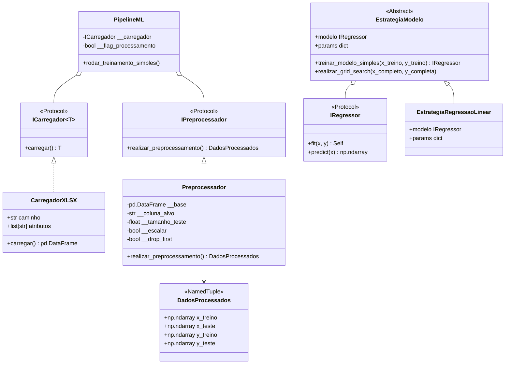

# 🏢 Previsão de Preço de Apartamentos em Ribeirão Preto (v3)

Sistema modular de Machine Learning para previsão de preços de apartamentos em Ribeirão Preto/SP. O projeto foi projetado seguindo princípios de **Clean Architecture**, **SOLID** (notadamente os princípios de Responsabilidade Única, Aberto/Fechado e Inversão de Dependência via *Protocols* do Python) e padrões de projeto (**Strategy**, **Protocol**, **NamedTuple**), além de contar com suporte a rastreamento de experimentos via **MLflow**, **MinIO (S3)** e **PostgreSQL**.

---

## 📌 Sumário
- [Visão Geral](#-visão-geral)
- [Arquitetura do Projeto](#-arquitetura-do-projeto)
- [Estrutura de Diretórios](#-estrutura-de-diretórios)
- [Conjunto de Dados](#-conjunto-de-dados)
- [Pipeline de Pré-processamento](#-pipeline-de-pré-processamento)
- [Estratégias de Modelagem](#-estratégias-de-modelagem)
- [Infraestrutura MLOps (Docker)](#-infraestrutura-mlops-docker)
- [Instalação e Execução](#-instalação-e-execução)
- [Testes e Qualidade](#-testes-e-qualidade)
- [Extensibilidade para Novos Modelos](#-extensibilidade-para-novos-modelos)

---

## 🎯 Visão Geral

O objetivo deste projeto é estimar o **Valor da Venda** de imóveis a partir de características físicas (número de quartos, banheiros, vagas, metragem) e localização (Zona, Bairro).

Diferenciais da versão 3:
- **Separação estrita de responsabilidades**: interfaces claras para carregamento, pré-processamento, estratégias de modelos e avaliação.
- **Prevenção de vazamento de dados (*Data Leakage*)**: padronização e imputações ajustadas estritamente nos dados de treino.
- **Prevenção da *Dummy Variable Trap***: codificação de variáveis categóricas usando One-Hot Encoding com descarte da primeira categoria (`drop_first=True`), garantindo que modelos lineares OLS não sofram com multicolinearidade perfeita.
- **Testabilidade**: cobertura de testes unitários e tipagem estática com `mypy`.

---

## 🏛 Arquitetura do Projeto

O sistema utiliza os seguintes padrões de projeto:



---

## 📂 Estrutura de Diretórios

```text
previsao_preco_apartamentos_rp_v3/
├── config/                 # Configurações gerais
├── docs/                   # Dados e artefatos de dados
│   └── bairro_final_v3_engineered_bkp.xlsx
├── src/                    # Código-fonte principal
│   ├── avaliador/          # Métricas e interfaces de avaliação
│   │   ├── avaliador.py
│   │   └── imodelo_previsor.py
│   ├── carregador/         # Carregamento de dados (I/O)
│   │   ├── carregador_csv.py
│   │   └── icarregador.py
│   ├── estrategia_modelo/  # Padrão Strategy para algoritmos de ML
│   │   ├── estrategia_modelo.py
│   │   ├── estrategia_regressao_linear.py
│   │   └── iregressor.py
│   ├── processador/        # Pipeline de pré-processamento de features
│   │   ├── __init__.py
│   │   ├── ipreprocessador.py
│   │   └── preprocessador.py
│   └── main.py             # Ponto de entrada e orquestração (PipelineML)
├── tests/                  # Testes unitários automatizados
│   └── test_preprocessador.py
├── docker-compose.yaml     # Orquestração do ecossistema MLflow, Postgres e MinIO
├── pyproject.toml          # Configurações de ferramentas (mypy)
├── .env                    # Variáveis de ambiente
└── README.md               # Documentação técnica do projeto
```

---

## 📊 Conjunto de Dados

A base contém **5.712 registros** de apartamentos em Ribeirão Preto, com atributos físicos, geográficos e métricas de mercado:

| Coluna | Tipo | Descrição | Papel no Pipeline |
| :--- | :--- | :--- | :--- |
| `Código` | Numérico | Identificador único do imóvel | Removido (sem valor preditivo) |
| `Apartamento` | Texto | Descrição do imóvel | Removido / Opcional |
| `Bairro` | Categórico | Nome do bairro (153 bairros distintos) | Feature geográfica |
| `Zona` | Categórico | Zona da cidade (Sul, Norte, Leste, Oeste, Centro) | Feature codificada via One-Hot |
| `Quartos` | Numérico | Quantidade de quartos | Feature preditora |
| `Banheiros` | Numérico | Quantidade de banheiros | Feature preditora |
| `Vagas` | Numérico | Quantidade de vagas de garagem | Feature preditora |
| `Metragem` | Numérico | Área útil do imóvel em m² | Feature preditora |
| `Valor_da_Venda` | Numérico | Preço anunciado de venda do imóvel em R$ | **Variável Alvo ($y$)** |
| `valor_m2` | Numérico | Valor por metro quadrado | Removido (*Data Leakage* de $y$) |
| `media_valor_m2_bairro`| Numérico | Média do m² por bairro | Feature opcional de engenharia |
| `media_valor_m2_zona`  | Numérico | Média do m² por zona | Feature opcional de engenharia |

---

## ⚙️ Pipeline de Pré-processamento

A classe [`Preprocessador`](src/processador/preprocessador.py) implementa o protocolo [`IPreprocessador`](src/processador/ipreprocessador.py) e executa as seguintes fases:

1. **Higienização e Antileakage**:
   - Descarta identificadores (`Código`, `Apartamento`) e colunas derivadas diretamente do alvo (`valor_m2`).
2. **Imputação de Dados Ausentes**:
   - Mediana para colunas numéricas e moda para colunas categóricas.
3. **Codificação One-Hot com `drop_first=True`**:
   - Converte colunas de texto (como `Zona`) em variáveis binárias (dummies), removendo a categoria de referência para evitar a **Dummy Variable Trap** (colinearidade perfeita), crucial para inversão matricial em OLS (`LinearRegression`).
4. **Divisão Treino/Teste**:
   - `train_test_split` configurável (padrão: 80% treino, 20% teste).
5. **Escalonamento Configurável**:
   - Suporte nativo a múltiplos transformadores:
     - **`StandardScaler`** (`tipo_scaler="standard"`): Média zero e variância unitária ($\mu=0, \sigma=1$), ideal para regressão Ridge, Lasso e OLS.
     - **`MinMaxScaler`** (`tipo_scaler="minmax"`): Escala linear para o intervalo $[0, 1]$, ideal para atributos com limites naturais e modelos baseados em distância.
     - **`RobustScaler`** (`tipo_scaler="robust"`): Baseado na mediana e no intervalo interquartil (IQR: $Q_3 - Q_1$), altamente resistente a *outliers* de metragem e preços imobiliários.
     - **`MaxAbsScaler`** (`tipo_scaler="maxabs"`): Escala dividindo pelo valor absoluto máximo (preserva zeros).
     - **Customizado**: Aceita qualquer instância de objeto que implemente `fit_transform` e `transform`.
   - O `scaler` é ajustado **somente no treino** (`fit_transform`) e aplicado no teste (`transform`), blindando o teste contra vazamento de informações.
### Métodos Disponíveis para Demonstração e Uso Granular

Além do método unificado `realizar_preprocessamento()`, a classe [`Preprocessador`](src/processador/preprocessador.py) fornece métodos modulares para demonstrar e executar cada fase de forma independente:

1. **`remover_colunas_desnecessarias(df=None)`**: Exibe e executa o descarte de colunas irrelevantes (`Código`) e vazamento de dados (`valor_m2`).
2. **`tratar_valores_ausentes(df=None)`**: Demonstra a imputação (mediana em numéricas, moda em categóricas).
3. **`separar_features_e_alvo(df=None)`**: Separa e retorna a tupla `(X, y)`.
4. **`codificar_categoricas(x)`**: Executa o One-Hot Encoding com `drop_first=True` para prevenir multicolinearidade.
5. **`dividir_treino_teste(x, y)`**: Particiona os dados na proporção configurada (ex: 80%/20%).
6. **`escalonar_dados(x_treino, x_teste)`**: Padroniza as matrizes via `StandardScaler` (fit apenas no treino).
7. **`demonstrar_passo_a_passo(base=None)`**: Executa o fluxo didático completo, imprimindo as métricas e transformações em cada estágio e retornando um dicionário com os artefatos de cada fase.

#### Métodos de Demonstração de Modos de Uso:
```python
# Modo 1: Base no construtor
dados = Preprocessador.demonstrar_uso_base_no_construtor(df)

# Modo 2: Atribuição tardia via setter
dados = Preprocessador.demonstrar_uso_atribuicao_tardia(df)

# Modo 3: Passagem direta no método
dados = Preprocessador.demonstrar_uso_passagem_direta(df)
```

---

## 🧠 Estratégias de Modelagem

O projeto adota o padrão **Strategy** (`EstrategiaModelo`) para permitir a troca fluida de algoritmos:

- **Contrato (`IRegressor`)**: Protocolo simples que exige `fit(x, y)` e `predict(x)`.
- **Estratégia Base (`EstrategiaModelo`)**:
  - `treinar_modelo_simples(x_treino, y_treino)`: Ajusta o regressor.
  - `realizar_grid_search(x_completo, y_completa)`: Otimização de hiperparâmetros via `GridSearchCV`.
- **Implementação Atual (`EstrategiaRegressaoLinear`)**:
  - Encapsula o `LinearRegression` do scikit-learn com suporte a parâmetros como `fit_intercept`, `positive`, etc.

---

## 🐳 Infraestrutura MLOps (Docker)

O projeto possui orquestração via `docker-compose.yaml` pronta para auditoria e governança de Machine Learning:

| Serviço | Imagem | Porta | Finalidade |
| :--- | :--- | :--- | :--- |
| **PostgreSQL** | `postgres:15` | `5432` | Banco de dados para metadados do MLflow |
| **MinIO** | `minio/minio` | `9000` (API), `9001` (Console) | Object Storage S3 para armazenamento de artefatos/modelos |
| **MLflow Server** | `ghcr.io/mlflow/mlflow` | `5000`, `5004` | Interface e servidor de rastreamento de experimentos |

Para iniciar a infraestrutura:
```bash
docker compose up -d
```
Acesse o console do MinIO em `http://localhost:9001` e a UI do MLflow em `http://localhost:5000`.

---

## 🚀 Instalação e Execução

### 1. Pré-requisitos
- Python 3.12+
- Docker e Docker Compose (opcional, para ambiente MLflow)

### 2. Ativar Ambiente Virtual
```bash
source .venv/bin/activate
```

### 3. Instalar Dependências (se necessário)
```bash
pip install -r requirements.txt  # ou via pip diretamente: pandas, scikit-learn, numpy, openpyxl, mypy
```

### 4. Executar o Pipeline Principal
```bash
python src/main.py
```

#### Como Escolher o Tipo de Processamento no `src/main.py`
O arquivo `src/main.py` utiliza injeção de dependência para permitir a configuração precisa do pipeline de dados:

```python
from carregador.carregador_csv import CarregadorXLSX
from processador.preprocessador import Preprocessador
from main import PipelineML

if __name__ == '__main__':
    lista = ['Zona', 'Quartos', 'Banheiros', 'Vagas', 'Metragem', 'Valor_da_Venda']
    caminho_arquivo = os.path.join(os.getcwd(), 'docs', 'bairro_final_v3_engineered_bkp.xlsx')
    carregador = CarregadorXLSX(caminho=caminho_arquivo, atributos=lista)

    # -------------------------------------------------------------------------
    # ESCOLHA DA ESTRATÉGIA DE PRÉ-PROCESSAMENTO:
    # -------------------------------------------------------------------------
    
    # OPÇÃO 1: Processamento Robusto a Outliers (Recomendado para imóveis)
    preprocessador = Preprocessador(
        tipo_scaler="robust",   # RobustScaler: baseado em mediana e IQR
        escalar=True,
        drop_first=True,        # Evita a Dummy Variable Trap em modelos lineares
        tamanho_teste=0.2,      # 20% para teste, 80% para treino
        random_state=42,
    )

    # OPÇÃO 2: Padronização Clássica Z-Score (Média 0, Variância 1)
    # preprocessador = Preprocessador(tipo_scaler="standard")

    # OPÇÃO 3: Normalização Linear no intervalo [0, 1]
    # preprocessador = Preprocessador(tipo_scaler="minmax")

    # OPÇÃO 4: Para Modelos de Árvore (Random Forest, XGBoost) sem escalonamento
    # preprocessador = Preprocessador(escalar=False, drop_first=False)

    # Injeção de dependência no PipelineML:
    pml = PipelineML(
        carregador_dados=carregador,
        preprocessador=preprocessador,
        flag_processamento=True,
    )
    pml.rodar_treinamento_simples()
```

#### Tabela de Opções de Processamento:

| Parâmetro | Valores Suportados | Cenário Recomendado |
| :--- | :--- | :--- |
| **`tipo_scaler`** | `"robust"` | **Imóveis/Mercado Imobiliário**: dados com forte assimetria e presença de *outliers* (coberturas, mansões). |
| | `"standard"` | Regressão linear clássica (OLS, Ridge, Lasso) assumindo distribuição aproximadamente normal. |
| | `"minmax"` | Quando se deseja manter valores delimitados estritamente em $[0, 1]$. |
| | `"maxabs"` | Escala pelo valor absoluto máximo (ideal para matrizes esparsas). |
| **`escalar`** | `True` / `False` | `True` para modelos lineares/distância/redes neurais; `False` para modelos de árvore (Random Forest, XGBoost). |
| **`drop_first`** | `True` / `False` | `True` descarta a primeira categoria dummy evitando colinearidade exata em OLS. |
| **`flag_processamento`**| `True` / `False` | No `PipelineML`: `True` executa o pré-processamento; `False` imprime o DataFrame original. |

Saída esperada:
```text
=== PIPELINE ML COM SCALER: 'ROBUST' ===
Colunas de features: ['Quartos', 'Banheiros', 'Vagas', 'Metragem', 'Zona_Zona Leste', 'Zona_Zona Norte', 'Zona_Zona Oeste', 'Zona_Zona Sul']
Formato dos dados processados:
X_treino: (4569, 8), y_treino: (4569,)
X_teste: (1143, 8), y_teste: (1143,)
```


---

## 🧪 Testes e Qualidade

### Execução dos Testes Unitários
Os testes utilizam `unittest` da biblioteca padrão e cobrem todas as funcionalidades do pré-processador:
```bash
PYTHONPATH=src python -m unittest discover -s tests -p "test_*.py"
```

### Verificação Estática de Tipos (Mypy)
Como o arquivo `pyproject.toml` já está configurado com `mypy_path = "src"` e `files = ["src", "tests"]`, basta executar:
```bash
mypy
```
Ou especificando os diretórios:
```bash
mypy src/
```

---

## 🔮 Extensibilidade para Novos Modelos

O projeto está estruturado para suportar novos algoritmos com facilidade:

1. **Novas Regressões (Ridge, Lasso, ElasticNet, SVR)**:
   - Crie uma nova estratégia em `src/estrategia_modelo/` herdando de `EstrategiaModelo`. O [`Preprocessador`](src/processador/preprocessador.py) já fornece os dados escalonados e codificados necessários.
2. **Modelos Baseados em Árvores (Random Forest, XGBoost)**:
   - Instancie o `Preprocessador` desativando a padronização:
     ```python
     preprocessador = Preprocessador(base, escalar=False, drop_first=False)
     ```
3. **Novos Pré-processadores Especializados**:
   - Basta implementar a interface [`IPreprocessador`](src/processador/ipreprocessador.py). O pipeline aceita qualquer classe que forneça `realizar_preprocessamento() -> DadosProcessados`.
