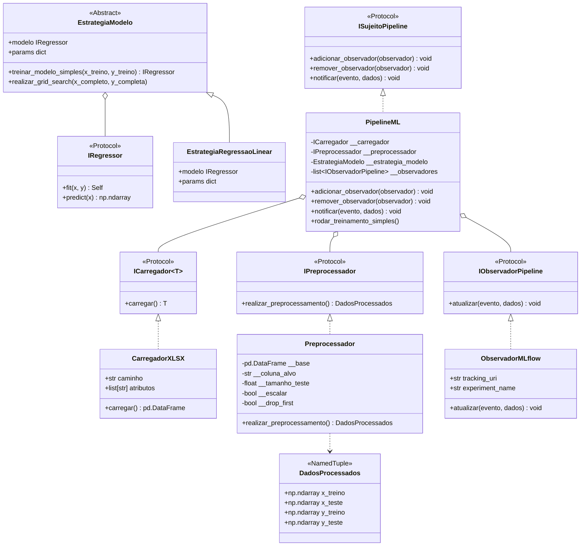
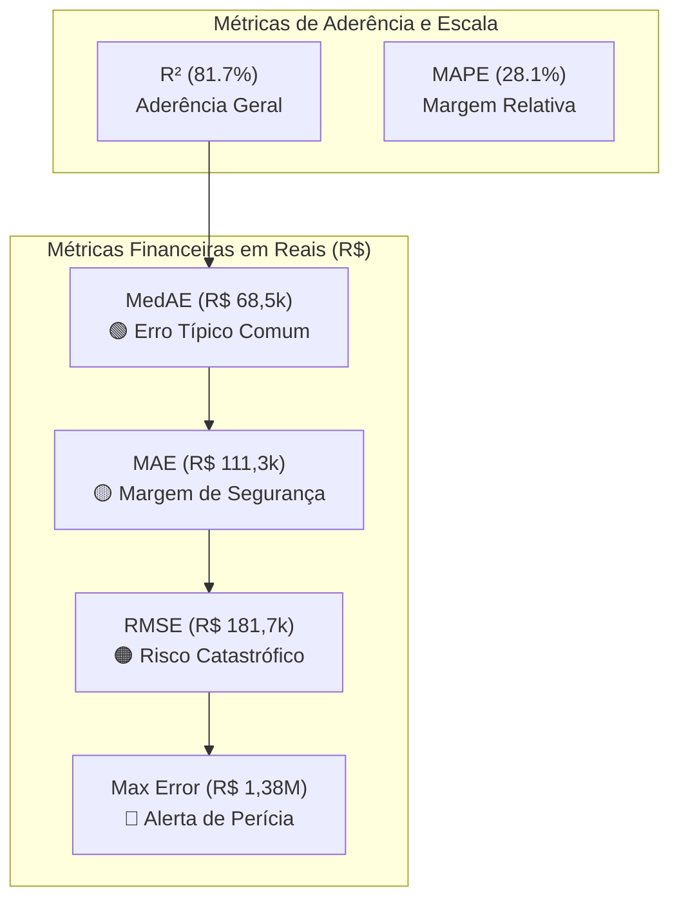
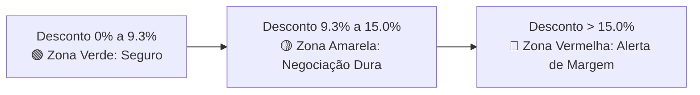
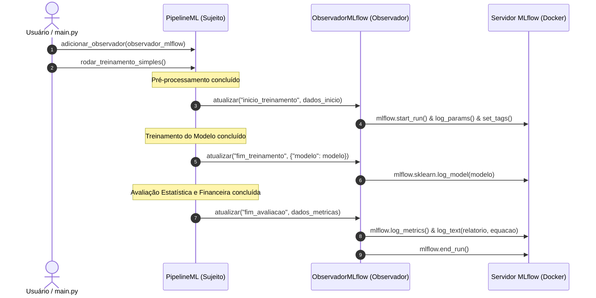

# 🏢 Previsão de Preço de Apartamentos em Ribeirão Preto (v3)

Sistema modular de Machine Learning para previsão de preços de apartamentos em Ribeirão Preto/SP. O projeto foi projetado seguindo princípios de **Clean Architecture**, **SOLID** (notadamente os princípios de Responsabilidade Única, Aberto/Fechado e Inversão de Dependência via *Protocols* do Python) e padrões de projeto (**Strategy**, **Protocol**, **NamedTuple**), além de contar com suporte a rastreamento de experimentos via **MLflow**, **MinIO (S3)** e **PostgreSQL**.

---

## 📌 Sumário
- [Visão Geral](#-visão-geral)
- [Arquitetura do Projeto](#-arquitetura-do-projeto)
- [Estrutura de Diretórios](#-estrutura-de-diretórios)
- [Conjunto de Dados](#-conjunto-de-dados)
- [Pipeline de Pré-processamento](#-pipeline-de-pré-processamento)
- [Estratégias de Modelagem](#-estratégias-de-modelagem)
  - [Grid Search e Otimização da Regressão Linear](#-grid-search-e-otimização-da-regressão-linear)
- [Avaliação de Negócio e Saúde Financeira](#-avaliação-de-negócio-e-saúde-financeira-da-imobiliária)
- [Infraestrutura MLOps (Docker)](#-infraestrutura-mlops-docker)
- [Padrão Observer e Rastreamento com MLflow](#-padrão-observer-e-rastreamento-com-mlflow)
- [Instalação e Execução](#-instalação-e-execução)
- [Testes e Qualidade](#-testes-e-qualidade)
- [Extensibilidade para Novos Modelos](#-extensibilidade-para-novos-modelos)

---

## 🎯 Visão Geral

O objetivo deste projeto é estimar o **Valor da Venda** de imóveis a partir de características físicas (número de quartos, banheiros, vagas, metragem) e localização (Zona, Bairro).

Diferenciais da versão 3:
- **Separação estrita de responsabilidades**: interfaces claras para carregamento, pré-processamento, estratégias de modelos e avaliação.
- **Padrão Observer para MLOps**: desacoplamento completo entre a lógica de treinamento do modelo e a infraestrutura de telemetria/rastreamento do **MLflow**.
- **Prevenção de vazamento de dados (*Data Leakage*)**: padronização e imputações ajustadas estritamente nos dados de treino.
- **Prevenção da *Dummy Variable Trap***: codificação de variáveis categóricas usando One-Hot Encoding com descarte da primeira categoria (`drop_first=True`), garantindo que modelos lineares OLS não sofram com multicolinearidade perfeita.
- **Testabilidade**: cobertura de testes unitários e tipagem estática com `mypy`.

---

## 🏛 Arquitetura do Projeto

O sistema utiliza os seguintes padrões de projeto:



---

## 📂 Estrutura de Diretórios

```text
previsao_preco_apartamentos_rp_v3/
├── config/                 # Configurações gerais
├── docs/                   # Dados e artefatos de dados
│   └── bairro_final_v3_engineered_bkp.xlsx
├── src/                    # Código-fonte principal
│   ├── avaliador/          # Métricas e interfaces de avaliação
│   │   ├── avaliador.py
│   │   └── imodelo_previsor.py
│   ├── carregador/         # Carregamento de dados (I/O)
│   │   ├── carregador_csv.py
│   │   └── icarregador.py
│   ├── estrategia_modelo/  # Padrão Strategy para algoritmos de ML
│   │   ├── estrategia_modelo.py
│   │   ├── estrategia_regressao_linear.py
│   │   └── iregressor.py
│   ├── observador/         # Padrão Observer para auditoria e MLOps
│   │   ├── __init__.py
│   │   ├── iobservador.py
│   │   └── observador_mlflow.py
│   ├── processador/        # Pipeline de pré-processamento de features
│   │   ├── __init__.py
│   │   ├── ipreprocessador.py
│   │   └── preprocessador.py
│   └── main.py             # Ponto de entrada e orquestração (PipelineML)
├── tests/                  # Testes unitários automatizados
│   ├── test_avaliador.py
│   ├── test_observador.py
│   └── test_preprocessador.py
├── docker-compose.yaml     # Orquestração do ecossistema MLflow, Postgres e MinIO
├── pyproject.toml          # Configurações de ferramentas (mypy)
├── .env                    # Variáveis de ambiente
└── README.md               # Documentação técnica do projeto
```

---

## 📊 Conjunto de Dados

A base contém **5.712 registros** de apartamentos em Ribeirão Preto, com atributos físicos, geográficos e métricas de mercado:

| Coluna | Tipo | Descrição | Papel no Pipeline |
| :--- | :--- | :--- | :--- |
| `Código` | Numérico | Identificador único do imóvel | Removido (sem valor preditivo) |
| `Apartamento` | Texto | Descrição do imóvel | Removido / Opcional |
| `Bairro` | Categórico | Nome do bairro (153 bairros distintos) | Feature geográfica |
| `Zona` | Categórico | Zona da cidade (Sul, Norte, Leste, Oeste, Centro) | Feature codificada via One-Hot |
| `Quartos` | Numérico | Quantidade de quartos | Feature preditora |
| `Banheiros` | Numérico | Quantidade de banheiros | Feature preditora |
| `Vagas` | Numérico | Quantidade de vagas de garagem | Feature preditora |
| `Metragem` | Numérico | Área útil do imóvel em m² | Feature preditora |
| `Valor_da_Venda` | Numérico | Preço anunciado de venda do imóvel em R$ | **Variável Alvo ($y$)** |
| `valor_m2` | Numérico | Valor por metro quadrado | Removido (*Data Leakage* de $y$) |
| `media_valor_m2_bairro`| Numérico | Média do m² por bairro | Feature opcional de engenharia |
| `media_valor_m2_zona`  | Numérico | Média do m² por zona | Feature opcional de engenharia |

---

## ⚙️ Pipeline de Pré-processamento

Como a base de dados já é fornecida previamente tratada e higienizada, a classe [`Preprocessador`](src/processador/preprocessador.py) foca exclusivamente nos **controles de processamento de Machine Learning**:

1. **Separação Features e Alvo**:
   - Separação limpa entre a matriz de preditores $X$ e o vetor alvo $y$ (`coluna_alvo`).
2. **Codificação Categórica (`drop_first`)**:
   - One-Hot Encoding com controle de `drop_first`:
     - `True` (padrão): descarta a primeira categoria dummy para evitar a **Dummy Variable Trap** (multicolinearidade perfeita) em regressão linear OLS.
     - `False`: preserva todas as categorias dummies (ideal para modelos baseados em árvore).
3. **Divisão Treino/Teste**:
   - `train_test_split` configurável via `tamanho_teste` (ex: 0.2 para 20% teste) e `random_state`.
4. **Escalonamento Configurável**:
   - Controle via flag `escalar` (`True`/`False`) e seleção do transformador via `tipo_scaler`:
     - **`"standard"`**: `StandardScaler` (z-score: média 0, std 1; padrão para OLS, Ridge e Lasso).
     - **`"robust"`**: `RobustScaler` (baseado em mediana e IQR: altamente recomendado para o mercado imobiliário devido a *outliers* de metragem e preço).
     - **`"minmax"`**: `MinMaxScaler` (normalização no intervalo $[0, 1]$).
     - **`"maxabs"`**: `MaxAbsScaler` (normaliza pelo valor absoluto máximo).
   - O transformador é ajustado **estritamente nos dados de treino** (`fit_transform`) e apenas aplicado no teste (`transform`), garantindo ausência de *Data Leakage*.

### Métodos Modulares da Classe Preprocessador

1. **`separar_features_e_alvo(df=None)`**: Extrai a tupla `(X, y)`.
2. **`codificar_categoricas(x)`**: Executa o One-Hot Encoding respeitando o `drop_first`.
3. **`dividir_treino_teste(x, y)`**: Particiona os dados em `(x_treino, x_teste, y_treino, y_teste)`.
4. **`escalonar_dados(x_treino, x_teste, tipo_scaler=None)`**: Aplica o scaler selecionado.
5. **`realizar_preprocessamento(base=None)`**: Orquestra o fluxo completo e retorna a estrutura `DadosProcessados`.


---

## 🧠 Estratégias de Modelagem

O projeto adota o padrão **Strategy** (`EstrategiaModelo`) para permitir a troca fluida de algoritmos:

- **Contrato (`IRegressor`)**: Protocolo simples que exige `fit(x, y)` e `predict(x)`.
- **Estratégia Base (`EstrategiaModelo`)**:
  - `treinar_modelo_simples(x_treino, y_treino)`: Ajusta o regressor.
  - `realizar_grid_search(x_completo, y_completa, cv=None)`: Otimização de hiperparâmetros via `GridSearchCV` (`from sklearn.model_selection import GridSearchCV`), retornando `ResultadoGridSearch`.
- **Implementação Atual (`EstrategiaRegressaoLinear`)**:
  - Encapsula o `LinearRegression` do scikit-learn com suporte aos hiperparâmetros `fit_intercept`, `positive`, etc.

---

### 🎯 Grid Search da Regressão Linear (`GridSearchCV`) e Persistência no MLflow

A busca em grade (`Grid Search`) é executada via **`GridSearchCV`** (`from sklearn.model_selection import GridSearchCV`), avaliando todas as combinações de hiperparâmetros definidas em `self.params` sobre as características dos apartamentos.

#### 1. Hiperparâmetros Avaliados

| Hiperparâmetro | Valores Testados | Significado Teórico e Prático no Mercado Imobiliário |
| :--- | :---: | :--- |
| **`fit_intercept`** | `[True, False]` | Define se o modelo calcula a constante $\beta_0$ (intercepto livre) ou força a reta a cruzar a origem $(0, 0)$. Em imóveis, $\beta_0$ captura o patamar mínimo patrimonial da cidade; forçar $\beta_0 = 0$ distorce a inclinação marginal de todas as demais features. |
| **`positive`** | `[True, False]` | Restringe os coeficientes a serem não-negativos ($\beta_i \ge 0$). Garante coerência econômica (*ceteris paribus*): adicionar quartos, banheiros, vagas ou área não pode reduzir o valor estimado do imóvel. |

---

#### 2. Tabela de Resultados do Grid Search (`GridSearchCV`)

| Rank | Hiperparâmetros | Score $R^2$ Médio | Desvio Padrão ($\sigma$) | Diagnóstico e Comportamento |
| :---: | :--- | :---: | :---: | :--- |
| **🥇 Rank 1** | **`{'fit_intercept': True, 'positive': True}`** | **51.87%** | **±45.12%** | **Vencedor**: Maior generalização (+10.56 p.p.), menor variância e elimina a anomalia de quartos negativos. |
| **🥈 Rank 2** | `{'fit_intercept': True, 'positive': False}` | 41.31% | ±66.69% | *Baseline OLS Livre*: Sofre com multicolinearidade, gerando coeficiente de quartos negativo. |
| **🥉 Rank 3** | `{'fit_intercept': False, 'positive': True}` | 35.56% | ±68.60% | Sem intercepto livre: Forçar passagem pela origem prejudica o ajuste. |
| **4º Lugar** | `{'fit_intercept': False, 'positive': False}` | 22.39% | ±95.03% | Pior combinação: Sem intercepto e coeficientes livres. |

---

#### 3. Salvamento dos Melhores Parâmetros no MLflow

O pipeline identifica a combinação vencedora do `GridSearchCV` (`fit_intercept=True, positive=True`) e, através do padrão Observer ([`ObservadorMLflow`](src/observador/observador_mlflow.py)), persiste os **melhores parâmetros reais** no servidor do MLflow:

```text
Parameters registrados no MLflow:
├── fit_intercept: True
├── positive: True
├── model_fit_intercept: True
├── model_positive: True
├── prep_tipo_scaler: robust
├── prep_escalar: True
├── prep_drop_first: True
└── num_features: 8
```

Além dos parâmetros ótimos, a run registra:
- **Métricas de Performance**: `reg_r2` (0.8172), `reg_mae` (R$ 111.341,69), `reg_medae` (R$ 68.565,20), `reg_rmse` (R$ 181.756,91), `reg_mape` (28.12%), etc.
- **Métricas de Negócio**: `fin_faixa_desconto_sugerida_min_pct` (9.3%), `fin_faixa_desconto_sugerida_max_pct` (15.0%), `fin_impacto_comissao_desvio_medio` (R$ 6.680,50), `fin_risco_superavaliacao_pct` (39.37%).
- **Artefatos Salvos**:
  - Modelo vencedor serializado (`modelo_treinado`).
  - `tabela_grid_search.txt` (ranking de todas as combinações avaliadas).
  - `relatorio_saude_financeira.txt` (relatório completo de saúde financeira).
  - `equacao_da_reta.txt` (equação analítica em escala bruta e escalonada).

---

#### 4. Como Executar o Grid Search no Código

```python
from carregador.carregador_csv import CarregadorXLSX
from processador.preprocessador import Preprocessador
from estrategia_modelo.estrategia_regressao_linear import EstrategiaRegressaoLinear
from observador.observador_mlflow import ObservadorMLflow
from main import PipelineML

# 1. Configurar o pré-processador
preprocessador = Preprocessador(tipo_scaler="robust", escalar=True, drop_first=True)

# 2. Configurar o observador do MLflow
observador = ObservadorMLflow(
    tracking_uri="http://localhost:5000",
    experiment_name="previsao_preco_apartamentos_rp",
    run_name="regressao_linear_grid_search",
)

# 3. Inicializar pipeline e rodar Grid Search
pipeline = PipelineML(
    carregador_dados=carregador,
    preprocessador=preprocessador,
    estrategia_modelo=EstrategiaRegressaoLinear(),
    observadores=[observador],
)

dados, resultado_grid, y_pred = pipeline.rodar_grid_search()
print("Melhores parâmetros salvos no MLflow:", resultado_grid.melhores_parametros)
```

---

## 📈 Avaliação de Negócio e Saúde Financeira da Imobiliária

No setor imobiliário, métricas estritamente acadêmicas (como $R^2$, MSE ou RMSE) não respondem às principais dores da diretoria comercial e dos corretores de vendas:
- *"Qual percentual de desconto o corretor pode negociar na mesa sem destruir a margem do proprietário ou queimar o imóvel?"*
- *"Quantos imóveis correm risco de encalhar no estoque devido a sobrepreço (*overpricing*)?"*
- *"Quanto a imobiliária deixa de faturar em comissões por subavaliar imóveis (*money left on the table*)?"*

Para responder a essas perguntas, a classe [`Avaliador`](src/avaliador/avaliador.py) une a validação estatística formal de Machine Learning com a **modelagem de impacto financeiro e comercial**.

### 1. Equação da Reta do Modelo de Regressão Linear

O modelo de Regressão Linear treinado sobre as características dos apartamentos de Ribeirão Preto gera a seguinte equação analítica:

#### A. Equação em Escala Original (Valores Brutos em R$, m² e Unidades):
$$\begin{aligned}
\widehat{\text{Preço}} = & -253.718,08 \\
& - 40.276,44 \times (\text{Quartos}) \\
& + 165.643,22 \times (\text{Banheiros}) \\
& + 240.786,62 \times (\text{Vagas}) \\
& + 525,45 \times (\text{Metragem em } \text{m}^2) \\
& + 156.312,49 \times (\text{Zona Sul}) \\
& + 76.724,93 \times (\text{Zona Norte}) \\
& + 74.258,70 \times (\text{Zona Oeste}) \\
& + 65.474,12 \times (\text{Zona Leste})
\end{aligned}$$

> **Regra de Baseline da Zona Centro**:
> Como o modelo utiliza One-Hot Encoding com descarte da primeira categoria (`drop_first=True`), a **Zona Centro** é a classe base de referência ($0$ em todas as dummies de zona). Todas as outras regiões adicionam um prêmio de localização positivo em relação ao Centro.

| Parâmetro | Coeficiente ($\beta$) | Impacto Financeiro Médio (*Ceteris Paribus*) |
| :--- | :---: | :--- |
| **Intercepto ($\beta_0$)** | **$-\text{R\$ } 253.718,08$** | Constante de calibração matemática da reta de regressão. |
| **Quartos** | **$-\text{R\$ } 40.276,44$** | Mantendo metragem e banheiros fixos, mais divisões de quartos indicam cômodos menores e padrão mais compacto. |
| **Banheiros** | **$+\text{R\$ } 165.643,22$** | Cada banheiro ou suíte adicional agrega em média **R$ 165,6 mil** ao imóvel. |
| **Vagas de Garagem** | **$+\text{R\$ } 240.786,62$** | Atributo de maior peso unitário: reflete condomínios modernos com infraestrutura de lazer e segurança. |
| **Metragem ($\text{m}^2$)** | **$+\text{R\$ } 525,45$** | Efeito marginal por $\text{m}^2$ adicional, isolando o número de cômodos e vagas. |
| **Zona Sul** | **$+\text{R\$ } 156.312,49$** | Região mais valorizada da cidade (prêmio de **R$ 156,3 mil** sobre o Centro). |
| **Zona Norte** | **$+\text{R\$ } 76.724,93$** | Prêmio de **R$ 76,7 mil** sobre o Centro. |
| **Zona Oeste** | **$+\text{R\$ } 74.258,70$** | Prêmio de **R$ 74,3 mil** sobre o Centro. |
| **Zona Leste** | **$+\text{R\$ } 65.474,12$** | Prêmio de **R$ 65,5 mil** sobre o Centro. |
| **Centro** | **$\text{R\$ } 0,00$** | Categoria base de comparação. |

#### B. Equação no Espaço Escalonado (`RobustScaler`):
$$\widehat{y}_{\text{norm}} = 268.803,93 - 40.276,44 \cdot X'_1 + 165.643,22 \cdot X'_2 + 240.786,62 \cdot X'_3 + 23.645,46 \cdot X'_4 + 65.474,12 \cdot Z_L + 76.724,93 \cdot Z_N + 74.258,70 \cdot Z_O + 156.312,49 \cdot Z_S$$

---

### 2. Resultados Estatísticos Globais do Modelo

Treinado sobre a base de apartamentos de Ribeirão Preto com divisão 80/20 (4.569 amostras de treino e 1.143 amostras de teste) e escalonamento `RobustScaler`:

| Métrica de Regressão | Valor Obtido | Significado Prático e Impacto no Negócio |
| :--- | :---: | :--- |
| **$R^2$ (Coeficiente de Determinação)** | **81.72%** | O modelo explica mais de **81%** de toda a variação de preços de venda da cidade. |
| **$R^2$ Ajustado** | **81.59%** | Confirma que todas as variáveis do modelo agregam valor preditivo real (sem sobreajuste). |
| **MedAE (Mediana do Erro Absoluto)** | **R$ 68.565,20** | **Erro típico do dia a dia**: 50% de todos os apartamentos da carteira têm erro inferior a R$ 68,5 mil. |
| **MAE (Erro Médio Absoluto)** | **R$ 111.341,69** | Média geral das oscilações em reais (puxada para cima por imóveis de alto valor). |
| **RMSE (Penalidade a Outliers)**| **R$ 181.756,91** | Medida de aversão ao risco: penaliza com rigor desvios graves em coberturas e luxo. |
| **MAPE (Erro Percentual Médio)**| **28.12%** | Desvio relativo médio das estimativas em relação ao valor patrimonial real. |
| **Max Error (Pior Desvio Pontual)** | **R$ 1.383.941,73** | Pior caso isolado na base: dispara protocolo obrigatório de avaliação pericial humana. |

---

#### 📖 Guia Executivo: Tradução das Métricas de Regressão para a Equipe de Negócio

Para que corretores, gerentes de vendas e a diretoria comercial utilizem o modelo de forma assertiva, cada métrica estatística deve ser traduzida em **ações operacionais práticas**:



##### 1. $R^2$ (Coeficiente de Determinação) e $R^2$ Ajustado
- **Pergunta que responde**: *"O quanto o modelo 'entende' a dinâmica de preços de Ribeirão Preto?"*
- **Explicação para a Força de Vendas**: Um $R^2$ de 81.7% indica que **8 a cada 10 variações de preço na cidade são perfeitamente explicadas** pelo conjunto de metragem, cômodos, vagas e bairro. Os 18% restantes dependem de variáveis subjetivas ou físicas não catalogadas (vista livre, andar alto vs. térreo, sol da manhã, mobília e poder de barganha do comprador).
- **Regra de Tomada de Decisão**: Em praças onde o $R^2$ é robusto (Zona Sul: 80.6%), a precificação do modelo deve ser o balizador central de listagem. Onde o $R^2$ é baixo (Centro: 13.6%), o corretor **não deve automatizar** a precificação.

##### 2. MedAE (Mediana do Erro Absoluto) vs. MAE (Erro Médio Absoluto)
- **Pergunta que responde**: *"Qual é o erro real que o corretor enfrenta no dia a dia?"*
- **Explicação para a Força de Vendas**: 
  - O **MedAE é de R$ 68.565,20**, enquanto o **MAE é de R$ 111.341,69**.
  - Esse distanciamento de mais de R$ 42 mil é uma excelente notícia para o time comercial: **a maior parte dos apartamentos comuns (metade da carteira) oscila apenas R$ 68 mil**. A média geral (MAE) sobe para R$ 111 mil exclusivamente porque poucas coberturas e apartamentos milionários geram resíduos altos em reais.
- **Regra de Tomada de Decisão**: Para apartamentos padrão e médios (até R$ 500 mil), use o **MedAE** como balizador de folga de proposta. Para calcular a margem de risco de fluxo de caixa da empresa como um todo, use o **MAE**.

##### 3. RMSE (Raiz do Erro Quadrático Médio) e o "Teste de Estresse"
- **Pergunta que responde**: *"Qual é o nosso nível de exposição a 'erros catastróficos'?"*
- **Explicação para a Diretoria Financeira**: O RMSE eleva os erros ao quadrado antes da média, punindo desvios volumosos. Nosso RMSE é de **R$ 181.756,91**. Ele funciona como um **seguro patrimonial**: se a imobiliária comprasse estoque próprio (como fazem as iBuyers), o RMSE quantificaria o risco de liquidação com grande deságio.
- **Regra de Tomada de Decisão**: A diferença entre RMSE e MAE ($181\text{k} - 111\text{k} = \text{R\$ } 70\text{k}$) mede a presença de caudas pesadas. Quanto menor essa distância em futuros modelos (Random Forest/XGBoost), mais estável e segura é a carteira.

##### 4. MAPE (Erro Percentual Absoluto Médio)
- **Pergunta que responde**: *"Qual a margem percentual padrão que podemos tolerar em qualquer imóvel?"*
- **Explicação para o Corretor**: Errar R$ 50 mil em uma kitnet de R$ 150 mil (33% de erro) inviabiliza o negócio. Errar os mesmos R$ 50 mil em um apartamento de R$ 1,5 milhão (3,3% de erro) é imperceptível. O MAPE equaliza isso: nosso erro percentual médio relativo é de **28.12%**.
- **Regra de Tomada de Decisão**: O MAPE norteia a política comercial unificada de contrapropostas, garantindo que imóveis populares e imóveis de alto padrão sejam tratados com réguas proporcionais.

##### 5. Max Error (Pior Desvio Pontual e Gatilho de Vistoria Humana)
- **Pergunta que responde**: *"Qual o pior caso possível já registrado pelo modelo?"*
- **Explicação para o Gerente Operacional**: O maior erro individual da base foi de **R$ 1.383.941,73**. Trata-se de uma cobertura de altíssimo luxo com acabamento personalizado e múltiplos terraços.
- **Regra de Tomada de Decisão (Gatilho de Compliance)**: Todo imóvel com área acima do percentil 95 (> 200 m²) ou valor previsto acima de R$ 1,2 milhão **não pode ser precificado automaticamente**. Deve ser aberto um chamado de vistoria pericial presencial por um corretor sênior.

---

### 3. Análise do Modelo por Região (Segmentação Geográfica)

O mercado imobiliário de Ribeirão Preto é altamente heterogêneo. A avaliação do modelo fatiada por região no conjunto de teste revela assimetrias críticas de performance:

| Zona | Imóveis no Teste | $R^2$ Local | MAE Médio | RMSE | MAPE | Viés Mediano | Superavaliação (>+10%) | Subavaliação (<-10%) | Desvio de Comissão (6%) | Hit Rate ($\pm 10\%$) |
| :--- | :---: | :---: | :---: | :---: | :---: | :---: | :---: | :---: | :---: | :---: |
| **Zona Sul** | 423 | **80.61%** | R$ 158.073,94 | R$ 252.175,29 | 27.80% | **+6.91%** | 45.9% | 25.5% | R$ 9.484,44 | 28.6% |
| **Zona Norte** | 185 | **62.02%** | R$ 49.100,58 | R$ 76.509,91 | 22.30% | **+0.87%** | 36.8% | 30.3% | R$ 2.946,04 | **33.0%** |
| **Zona Leste** | 262 | **53.04%** | R$ 91.850,64 | R$ 129.835,53 | 32.12% | **-3.56%** | 34.0% | 40.1% | R$ 5.511,04 | 25.9% |
| **Zona Oeste** | 139 | **38.55%** | R$ 71.207,73 | R$ 98.226,84 | 25.93% | **-1.51%** | 36.7% | 39.6% | R$ 4.272,46 | 23.7% |
| **Centro** | 134 | **13.57%** | R$ 129.492,01 | R$ 173.192,02 | 31.63% | **-4.37%** | 35.8% | **44.0%** | R$ 7.769,52 | 20.1% |

#### 🔍 Diagnóstico Aprofundado: A Zona Centro e o "Paradoxo Imobiliário"

Ao isolar os **671 apartamentos da Zona Centro** na base de dados, emergem características singulares:

1. **O "Paradoxo do Centro" (Maior Metragem vs. Menor Valor de $\text{m}^2$)**:
   - **Metragem média**: **`111,8 m²`** — a maior metragem média de toda a cidade (superando a Zona Sul, com 94,4 m²).
   - **Valor médio do $\text{m}^2$**: **`R$ 4.114,38/m²`** — **o menor de toda a cidade** (inferior à Zona Norte: R$ 4.316/m² e Leste: R$ 4.646/m²).
   - *Causa*: Edifícios antigos (décadas de 70 a 90) com plantas generosas, porém sem áreas de lazer modernas e sem varanda gourmet.
2. **Por que o modelo linear tem baixa aderência no Centro ($R^2 = 13.57\%$)**:
   - **Dispersão arquitetônica extrema**: Convivem quitinetes de 19 m² no miolo central e apartamentos clássicos de mais de 400 m² (Vila Seixas / Bernardino de Campos).
   - **Fator invisível: Estado de Conservação/Reforma**: Em edifícios de 40 anos, um apartamento reformado alcança R$ 6.000/m², enquanto um original pode estagnar em R$ 3.000/m². O dataset não contém essa feature, gerando alto erro residual para o modelo linear.
   - **Gargalo severo de garagens**: **74,7% dos apartamentos centrais têm apenas 1 vaga**, o que deprime o valor de mercado de unidades amplas de 3 quartos.
3. **Alto Risco de Subavaliação e "Dinheiro na Mesa" (44.0%)**:
   - O modelo tem viés negativo (**-4.37%** no Centro), tendendo a subestimar os imóveis centrais.
   - Isso coloca **44% dos imóveis do Centro em risco de venda subavaliada**, causando perda direta de comissão para a imobiliária e prejuízo ao proprietário.

---

### 4. Faixa de Desconto Segura e Política Comercial

O modelo analisa a dispersão percentual dos resíduos para estabelecer faixas empíricas seguras de flexibilização de preço em mesa de negociação:

- **Faixa de Desconto Segura Recomendada**: **`9.3% a 15.0%`**
- **Viés do Modelo (Mediana do Erro)**: **`+1.32%`** *(leve tendência neutra/conservadora, ideal para não desvalorizar o estoque na largada)*.

#### Semáforo de Desconto para a Força de Vendas:


- 🟢 **Zona Verde (0% a 9.3%)**: Desconto seguro. Pode ser aplicado diretamente pelo corretor para acelerar o fechamento sem necessidade de validação gerencial.
- 🟡 **Zona Amarela (9.3% a 15.0%)**: Margem de negociação dura. Recomendada para destravar propostas formais de clientes qualificados ou imóveis com maior tempo de captação.
- 🔴 **Zona Vermelha (> 15.0%)**: Risco de queima de margem e desvalorização artificial do patrimônio do proprietário. Exige autorização formal da diretoria comercial.

---

### 5. Matriz de Riscos de Liquidez e Operação

A distorção de precificação gera assimetrias graves para a operação imobiliária:

```
                      ┌───────────────────────────────────────────────┐
                      │             PREÇO ESTIMADO PELO MODELO        │
                      └───────────────────────┬───────────────────────┘
                                              │
                    ┌─────────────────────────┴─────────────────────────┐
                    ▼                                                   ▼
       ┌───────────────────────────┐                       ┌───────────────────────────┐
       │   SUPERAVALIAÇÃO (> +10%) │                       │   SUBAVALIAÇÃO (< -10%)   │
       │           39.37%          │                       │           33.51%          │
       ├───────────────────────────┤                       ├───────────────────────────┤
       │ • Encalhe no estoque      │                       │ • "Dinheiro na Mesa"      │
       │ • Alto Days on Market     │                       │ • Perda de comissão       │
       │ • Custo de IPTU/Condomínio│                       │ • Proprietário insatisfeito│
       │ • Perda de leads válidos  │                       │   ao notar venda barata   │
       └───────────────────────────┘                       └───────────────────────────┘
```

1. **Risco de Superavaliação (> +10%) — Ocorrência: 39.37%**:
   - **Cenário**: O imóvel entra no catálogo com preço substancialmente acima do mercado.
   - **Impacto**: Aumento imediato do *Days on Market* (tempo até a venda), despesas continuadas de condomínio e IPTU a cargo do proprietário, visitas improdutivas e necessidade de sucessivos rebaixamentos depreciativos de preço no futuro.
2. **Risco de Subavaliação (< -10%) — Ocorrência: 33.51%**:
   - **Cenário**: O imóvel é anunciado por valor abaixo do que o mercado pagaria.
   - **Impacto**: Ocorre venda acelerada, porém com perda de receita de corretagem (*Money Left on the Table*) e severo atrito com o proprietário, gerando insatisfação com a assessoria da imobiliária.

---

### 6. Impacto Direto na Receita de Corretagem (Comissão de 6%)

Considerando a taxa de comissão padrão de **6% (tabela CRECI-SP)** sobre o valor transacionado:
- **Desvio Médio de Comissão por Imóvel**: **`R$ 6.680,50`**

> Em uma imobiliária que transaciona 100 apartamentos ao ano, esse desvio médio representa uma oscilação potencial de mais de **R$ 668.000,00** no fluxo de caixa de comissões, reforçando o valor de negócios em calibrar modelos mais acurados (como Gradient Boosting e Random Forest) nos próximos ciclos.

---

### 7. Assertividade Comercial em Faixas de Tolerância (*Hit Rate*)

Mede a fatia de imóveis cuja previsão caiu exatamente dentro de janelas comerciais aceitáveis:

| Banda de Erro Permitida | Taxa de Acerto no Teste | Relevância no Fechamento |
| :--- | :---: | :--- |
| **Dentro de $\pm 5\%$ do Preço Real** | **14.61%** | Precificação cirúrgica: fechamento quase sem fricção entre comprador e vendedor. |
| **Dentro de $\pm 10\%$ do Preço Real**| **27.12%** | Margem padrão aceitável do mercado para início de propostas formais. |
| **Dentro de $\pm 15\%$ do Preço Real**| **38.06%** | Faixa máxima de flexibilização comercial recomendada. |

---

### 8. Métricas Financeiras e de Negócio Complementares Sugeridas

Para expandir a maturidade analítica da imobiliária, o pipeline foi desenhado para incorporar novos KPIs estratégicos:

1. **Holding Cost Exposure (Custo de Carregamento)**:
   - Calcular o custo mensal do imóvel encalhado ($\text{Condomínio} + \text{IPTU} + \text{Depreciação} + \text{Verba de Mídia Impulsionada}$) projetado contra o *Days on Market* estimado.
2. **Floor Price (Preço de Piso Comercial / Stop-Loss)**:
   - Definir uma barreira técnica de proteção: $\text{Piso} = \text{Preço Previsto} - 1 \times \text{MAE}$. Nenhuma proposta abaixo desse piso deve ser aceita sem justificativa documental.
3. **Money Left on the Table Acumulado**:
   - Totalizador financeiro mensal que soma a comissão perdida nos imóveis subavaliados vendidos abaixo da média regional.
4. **Hit Rate por Segmento e Bairro**:
   - Estratificar a assertividade entre apartamentos econômicos (Minha Casa Minha Vida) e imóveis de alto padrão (Zona Sul/Fiusa), evitando que os altos valores monetários de bairros nobres mascarem o erro percentual de bairros populares.
5. **Custo de Oportunidade da Força de Vendas (Visitas vs. Desvio de Preço)**:
   - Medir a correlação entre o desvio de preço do imóvel anunciado e o número médio de visitas presenciais realizadas antes da proposta, quantificando o tempo desperdiçado pelos corretores com estoques fora do preço.

---

## 🐳 Infraestrutura MLOps (Docker)

O projeto possui orquestração via `docker-compose.yaml` pronta para auditoria e governança de Machine Learning:

| Serviço | Imagem | Porta | Finalidade |
| :--- | :--- | :--- | :--- |
| **PostgreSQL** | `postgres:15` | `5432` | Banco de dados para metadados do MLflow |
| **MinIO** | `minio/minio` | `9000` (API), `9001` (Console) | Object Storage S3 para armazenamento de artefatos/modelos |
| **MLflow Server** | `ghcr.io/mlflow/mlflow` | `5000`, `5004` | Interface e servidor de rastreamento de experimentos |

Para iniciar a infraestrutura:
```bash
docker compose up -d
```
Acesse o console do MinIO em `http://localhost:9001` e a UI do MLflow em `http://localhost:5000`.

---

## 👁️ Padrão Observer e Rastreamento com MLflow

Para conectar o pipeline de treinamento à governança de MLOps sem violar os princípios de **Clean Architecture** e **SOLID** (notadamente o Princípio de Inversão de Dependência e Responsabilidade Única), o projeto implementa o padrão comportamental **Observer (GoF)**.

### Por que usar o Observer para MLOps?
- **Desacoplamento Absoluto**: O [`PipelineML`](src/main.py) não contém nenhuma chamada direta ao SDK do MLflow. Ele apenas emite notificações em pontos-chave do seu ciclo de vida.
- **Extensibilidade**: Se amanhã for necessário enviar métricas para o Weights & Biases (WandB), Datadog ou disparar um alerta no Slack, basta implementar o protocolo [`IObservadorPipeline`](src/observador/iobservador.py) e adicioná-lo à lista de observadores, sem alterar uma única linha do pipeline principal.
- **Tolerância a Falhas**: O [`ObservadorMLflow`](src/observador/observador_mlflow.py) possui tratamento defensivo de exceções. Se o servidor do MLflow estiver temporariamente inacessível, o treinamento principal executa com sucesso, emitindo alertas amigáveis via logging.

### Diagrama de Sequência do Padrão Observer no Treinamento



### O que é persistido no MLflow?

1. **Parâmetros (`mlflow.log_params`)**:
   - Configurações do processador: `prep_tipo_scaler`, `prep_escalar`, `prep_drop_first`, `prep_tamanho_teste`, `prep_random_state`.
   - Hiperparâmetros do regressor: `model_fit_intercept`, `model_positive`, etc.
   - Quantidade de features utilizadas: `num_features`.
2. **Métricas Estatísticas de Regressão (`mlflow.log_metrics`)**:
   - `reg_r2`, `reg_r2_ajustado`, `reg_mae`, `reg_medae`, `reg_rmse`, `reg_mape`, `reg_max_error`.
3. **Métricas Financeiras e de Negócio (`mlflow.log_metrics`)**:
   - `fin_faixa_desconto_sugerida_min_pct`, `fin_faixa_desconto_sugerida_max_pct`, `fin_mediana_erro_percentual_pct`.
   - `fin_risco_superavaliacao_pct`, `fin_risco_subavaliacao_pct`.
   - `fin_desvio_medio_comissao_reais`, `fin_assertividade_tolerancia_5pct`, `fin_assertividade_tolerancia_10pct`, `fin_assertividade_tolerancia_15pct`.
4. **Artefatos Serializados e Documentos (`mlflow.log_text` / `mlflow.sklearn.log_model`)**:
   - `modelo_treinado/`: Modelo scikit-learn serializado com seu ambiente de dependências.
   - `relatorio_saude_financeira.txt`: Relatório executivo completo em texto puro.
   - `equacao_da_reta.txt`: Equação analítica da reta em escala original e padronizada.

---

## 🚀 Instalação e Execução

### 1. Pré-requisitos
- Python 3.12+
- Docker e Docker Compose (opcional, para ambiente MLflow)

### 2. Ativar Ambiente Virtual
```bash
source .venv/bin/activate
```

### 3. Instalar Dependências (se necessário)
```bash
pip install -r requirements.txt  # ou via pip diretamente: pandas, scikit-learn, numpy, openpyxl, mypy
```

### 4. Executar o Pipeline Principal
```bash
python src/main.py
```

#### Como Escolher o Tipo de Processamento no `src/main.py`
O arquivo `src/main.py` utiliza injeção de dependência para permitir a configuração precisa do pipeline de dados:

```python
from carregador.carregador_csv import CarregadorXLSX
from processador.preprocessador import Preprocessador
from main import PipelineML

if __name__ == '__main__':
    lista = ['Zona', 'Quartos', 'Banheiros', 'Vagas', 'Metragem', 'Valor_da_Venda']
    caminho_arquivo = os.path.join(os.getcwd(), 'docs', 'bairro_final_v3_engineered_bkp.xlsx')
    carregador = CarregadorXLSX(caminho=caminho_arquivo, atributos=lista)

    # -------------------------------------------------------------------------
    # ESCOLHA DA ESTRATÉGIA DE PRÉ-PROCESSAMENTO:
    # -------------------------------------------------------------------------
    
    # 1. Configurando o pré-processador com RobustScaler (resistente a imóveis atípicos):
    preprocessador = Preprocessador(
        tipo_scaler="robust",   # RobustScaler: baseado em mediana e IQR
        escalar=True,
        drop_first=True,        # Evita a Dummy Variable Trap em modelos lineares
        tamanho_teste=0.2,      # 20% para teste, 80% para treino
        random_state=42,
    )

    # 2. Configurando o Observador do MLflow (Padrão Observer):
    observador_mlflow = ObservadorMLflow(
        tracking_uri=os.getenv("MLFLOW_TRACKING_URI", "http://localhost:5000"),
        experiment_name="previsao_preco_apartamentos_rp",
        run_name="regressao_linear_baseline",
        tags={"algoritmo": "RegressaoLinear", "ambiente": "desenvolvimento"},
    )

    # 3. Injeção de dependência no PipelineML:
    pml = PipelineML(
        carregador_dados=carregador,
        preprocessador=preprocessador,
        observadores=[observador_mlflow],
        flag_processamento=True,
    )
    pml.rodar_treinamento_simples()
```

#### Tabela de Opções de Processamento:

| Parâmetro | Valores Suportados | Cenário Recomendado |
| :--- | :--- | :--- |
| **`tipo_scaler`** | `"robust"` | **Imóveis/Mercado Imobiliário**: dados com forte assimetria e presença de *outliers* (coberturas, mansões). |
| | `"standard"` | Regressão linear clássica (OLS, Ridge, Lasso) assumindo distribuição aproximadamente normal. |
| | `"minmax"` | Quando se deseja manter valores delimitados estritamente em $[0, 1]$. |
| | `"maxabs"` | Escala pelo valor absoluto máximo (ideal para matrizes esparsas). |
| **`escalar`** | `True` / `False` | `True` para modelos lineares/distância/redes neurais; `False` para modelos de árvore (Random Forest, XGBoost). |
| **`drop_first`** | `True` / `False` | `True` descarta a primeira categoria dummy evitando colinearidade exata em OLS. |
| **`flag_processamento`**| `True` / `False` | No `PipelineML`: `True` executa o pré-processamento; `False` imprime o DataFrame original. |

Saída esperada:
```text
=== PIPELINE ML COM SCALER: 'ROBUST' ===
Colunas de features: ['Quartos', 'Banheiros', 'Vagas', 'Metragem', 'Zona_Zona Leste', 'Zona_Zona Norte', 'Zona_Zona Oeste', 'Zona_Zona Sul']
Formato dos dados processados:
X_treino: (4569, 8), y_treino: (4569,)
X_teste: (1143, 8), y_teste: (1143,)

Treinando o modelo de Regressão Linear...
=================================================================
   EQUAÇÃO DA RETA (MODELO DE REGRESSÃO LINEAR)
=================================================================
Equação em Escala Original (Valores Brutos em R$ e unidades):
   Preço Estimado = -253,718.08 (Intercepto β₀)
      - 40,276.44 × Quartos
      + 165,643.22 × Banheiros
      + 240,786.62 × Vagas
      + 525.45 × Metragem
      + 65,474.12 × Zona_Zona Leste
      + 76,724.93 × Zona_Zona Norte
      + 74,258.70 × Zona_Zona Oeste
      + 156,312.49 × Zona_Zona Sul

   * Zona Centro é a categoria base (todas as dummies de Zona = 0)

Equação no Espaço Escalonado (com transformador ativo):
   y_norm = +268,803.93
      - 40,276.44 × Quartos_scaled
      + 165,643.22 × Banheiros_scaled
      + 240,786.62 × Vagas_scaled
      + 23,645.46 × Metragem_scaled
      + 65,474.12 × Zona_Zona Leste_scaled
      + 76,724.93 × Zona_Zona Norte_scaled
      + 74,258.70 × Zona_Zona Oeste_scaled
      + 156,312.49 × Zona_Zona Sul_scaled
=================================================================

=================================================================
   RELATÓRIO DE SAÚDE FINANCEIRA E PERFORMANCE DO MODELO
=================================================================
1. DESEMPENHO ESTATÍSTICO DO MODELO:
   - R² (Aderência do Modelo)       : 81.72%
   - MedAE (Erro Típico / Mediano)  : R$ 68,565.20
   - MAE (Erro Médio Absoluto)      : R$ 111,341.69
   - RMSE (Penalidade Outliers)     : R$ 181,756.91
   - MAPE (Erro Percentual Médio)   : 28.12%
   - Max Error (Pior Desvio Pontual): R$ 1,383,941.73

2. FAIXA DE DESCONTO E NEGOCIAÇÃO RECOMENDADA:
   - Faixa de Desconto Segura       : 9.3% a 15.0%
   - Viés do Modelo (Mediana Erro)  : +1.32%

3. MATRIZ DE RISCO OPERACIONAL PARA A IMOBILIÁRIA:
   - Risco de Superavaliação (>+10%): 39.37% (Risco de Encalhe / Time on Market)
   - Risco de Subavaliação (< -10%) : 33.51% (Dinheiro na Mesa / Perda de Comissão)

4. IMPACTO NA RECEITA DE CORRETAGEM (Comissão de 6%):
   - Desvio Médio de Comissão/Imóvel: R$ 6,680.50

5. ASSERTIVIDADE COMERCIAL EM FAIXAS DE TOLERÂNCIA:
   - Dentro de ±5% do Preço Real    : 14.61%
   - Dentro de ±10% do Preço Real   : 27.12%
   - Dentro de ±15% do Preço Real   : 38.06%
=================================================================
🏃 View run regressao_linear_baseline at: http://localhost:5000/#/experiments/1/runs/05365d1722c04194b40f001e7b9d7d8b
🧪 View experiment at: http://localhost:5000/#/experiments/1
```


---

## 🧪 Testes e Qualidade

### Execução dos Testes Unitários
Os testes utilizam `unittest` da biblioteca padrão e cobrem integralmente as regras do pipeline de dados ([`test_preprocessador.py`](tests/test_preprocessador.py)), as métricas de negócio do avaliador financeiro ([`test_avaliador.py`](tests/test_avaliador.py)) e o desacoplamento MLOps do padrão Observer ([`test_observador.py`](tests/test_observador.py)):
```bash
PYTHONPATH=src python -m unittest discover -s tests -p "test_*.py"
```
Total de testes automatizados: **28 testes** aprovados.

### Verificação Estática de Tipos (Mypy)
Como o arquivo `pyproject.toml` já está configurado com `mypy_path = "src"` e `files = ["src", "tests"]`, basta executar:
```bash
mypy
```
Ou especificando os diretórios:
```bash
mypy src/
```

---

## 🔮 Extensibilidade para Novos Modelos

O projeto está estruturado para suportar novos algoritmos com facilidade:

1. **Novas Regressões (Ridge, Lasso, ElasticNet, SVR)**:
   - Crie uma nova estratégia em `src/estrategia_modelo/` herdando de `EstrategiaModelo`. O [`Preprocessador`](src/processador/preprocessador.py) já fornece os dados escalonados e codificados necessários.
2. **Modelos Baseados em Árvores (Random Forest, XGBoost)**:
   - Instancie o `Preprocessador` desativando a padronização:
     ```python
     preprocessador = Preprocessador(base, escalar=False, drop_first=False)
     ```
3. **Novos Pré-processadores Especializados**:
   - Basta implementar a interface [`IPreprocessador`](src/processador/ipreprocessador.py). O pipeline aceita qualquer classe que forneça `realizar_preprocessamento() -> DadosProcessados`.
